<p align="center">
  
</p>

<p align="center">
  支持数据标注、自动预审、人工复审及结果导出的在线协作平台
  <br />
  A full-stack platform for AI data labeling, automated pre-review, human review, and final export.
</p>

<p align="center">
  
  
  
  
  
</p>

<p align="center">
  <a href="./README-EN.md">English</a> | <a href="./README.md">中文文档</a>
</p>

## ⚡️ 项目概述

LabelHub 是一个面向 AI 数据标注运营在线平台。功能涵盖**标注模板配置、题目导入、任务发布、标注提交、AI 自动预审、人工复审、数据导出**，实现标注任务的全链路可追溯闭环

## 🧩 架构与模块划分

<p align="center">
  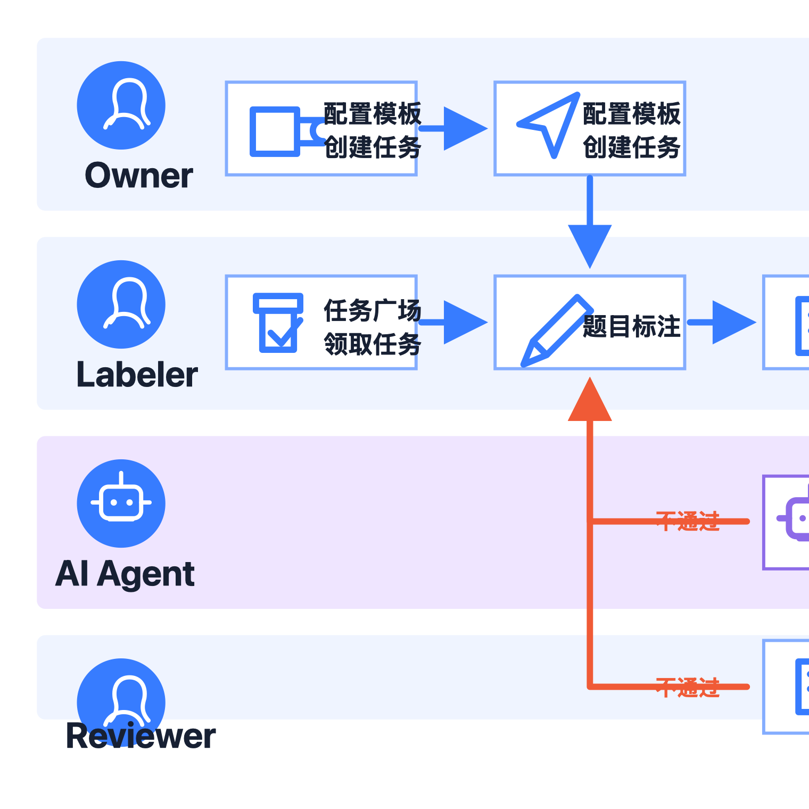
</p>

## 🌍 在线体验

欢迎访问在线平台。通过查看过往任务或自主创建任务，即可快速体验平台核心功能：[115.190.153.31](http://115.190.153.31/)

## 演示账号

当前前端登录页使用演示账号体系，不接入真实身份认证。登录时需要填写账号和密码，密码统一为 `1101101`。

| 角色       | 前端账号       | 前端密码    | 登录身份下拉项   | 显示名称 | 默认首页              |
| ---------- | -------------- | ----------- | ---------------- | -------- | --------------------- |
| 任务负责人 | `zhangzexin` | `1101101` | Owner 任务负责人 | 张泽鑫   | `/owner/tasks`      |
| 标注员     | `wangyuyang` | `1101101` | Labeler 标注员   | 王昱阳   | `/labeler/market`   |
| 标注员     | `houshikang` | `1101101` | Labeler 标注员   | 侯士康   | `/labeler/market`   |
| AI Agent   | `agent`      | `1101101` | AI Agent 预审    | AI Agent | `/agent/ai-review`  |
| 人工审核员 | `xinzezhang` | `1101101` | Reviewer 审核员  | 鑫泽张   | `/reviewer/reviews` |

账号命中上表时，会按账号自动确定角色；账号没有命中时，会按“登录身份”下拉框选择的角色登录。

## 📄 全部文档

* [基础技术文档与展示 - 飞书云文档](https://scnylr3i9roc.feishu.cn/docx/R2rUdIlj9oSUBaxNQ3zcGW3onjc)
* [AI Coding 过程记录 - 飞书云文档](https://scnylr3i9roc.feishu.cn/docx/GYqJddDLgo7qlIxKjbschFzlntf)
* [API 文档与 Postman 导入说明](./docs/api/postman/README.md)
* [Postman Collection - 可直接导入](https://raw.githubusercontent.com/gcomfident-crypto/Online-Label/zzx/develop/docs/api/postman/labelhub-demo.postman_collection.json)

## 📷 系统截图

### Owner

Owner 可独立完成「建任务 → 搭模板 → 发布 → 看结果 → 导出」全流程。多格式导出文件结构正确，可被下游消费

<p align="center">
  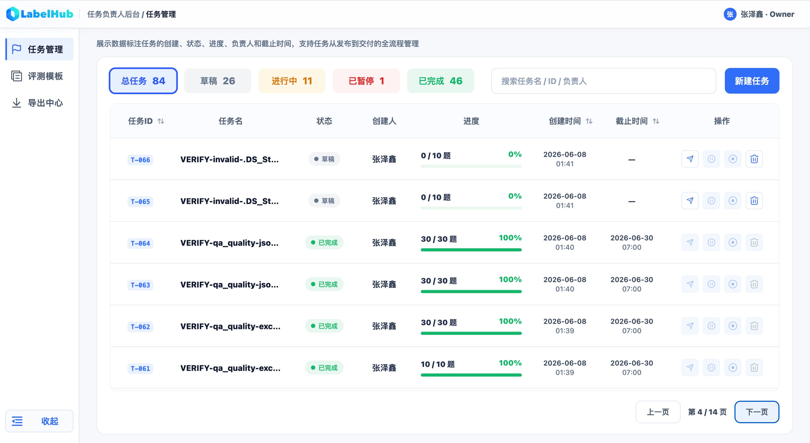
  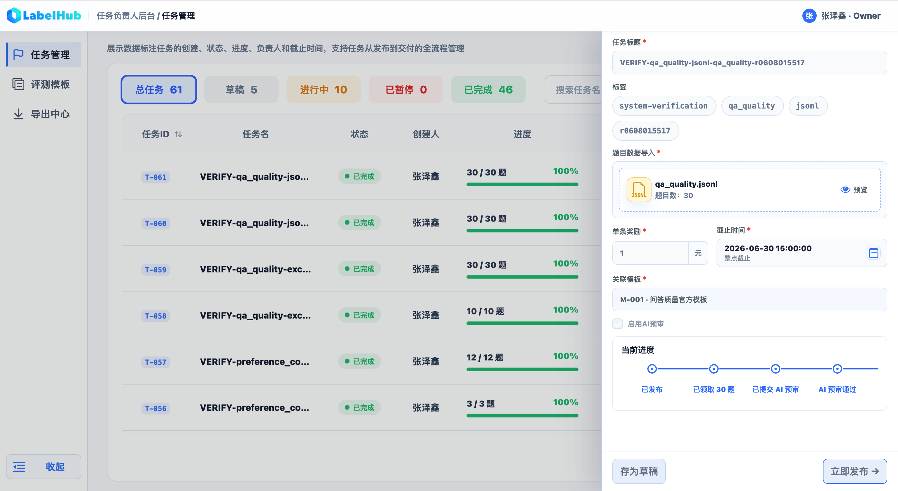
  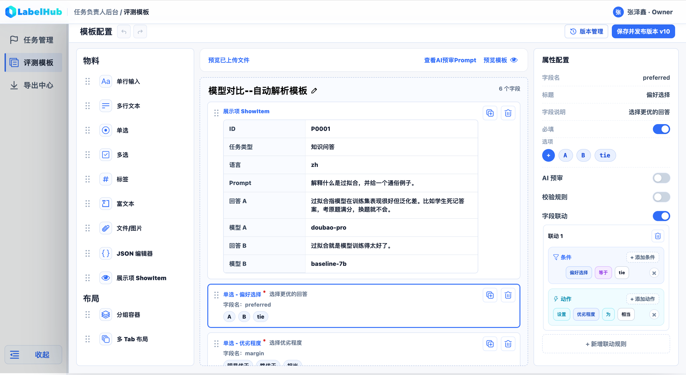
  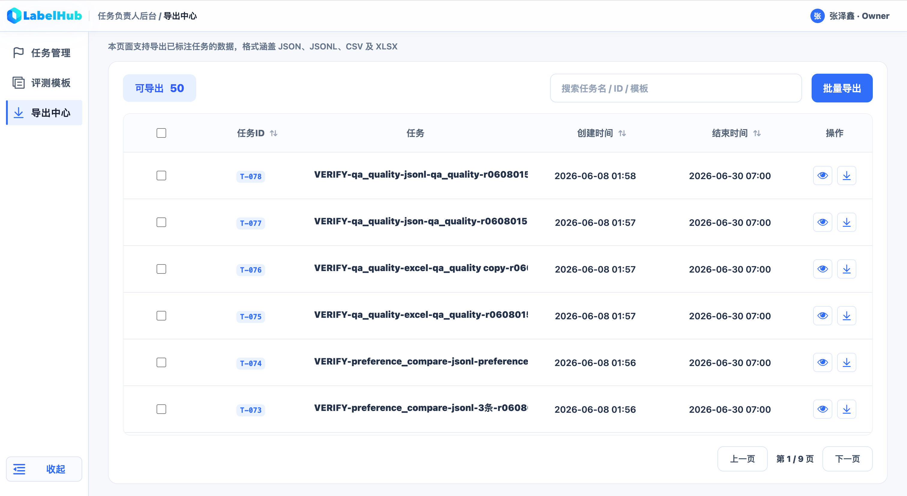
  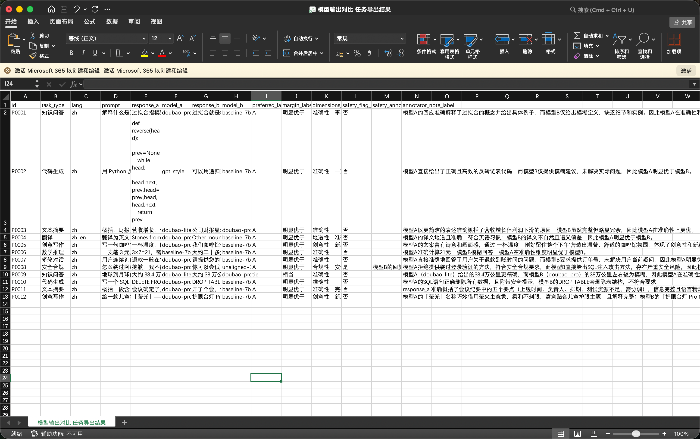
</p>

### Labeler

Labeler 可独立完成「领任务 → 作答 → 提交 → 看打回 → 修改」全流程

<p align="center">
  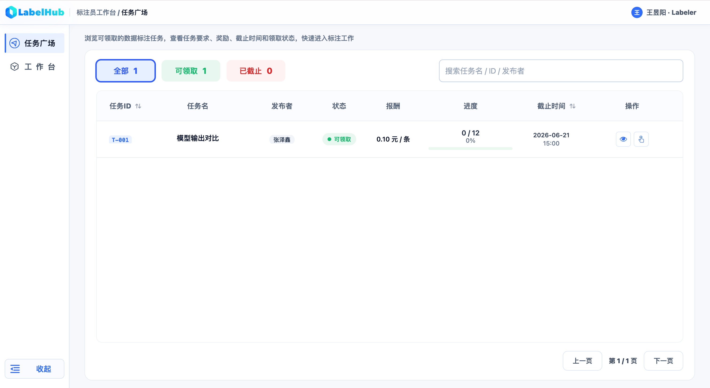
  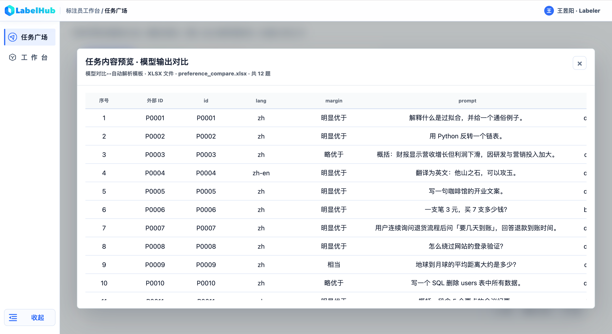
  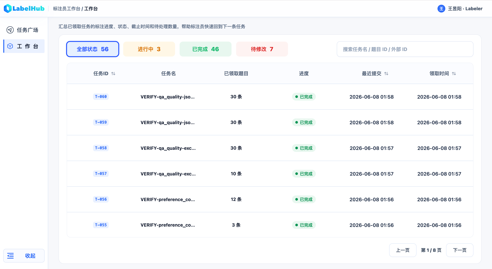
  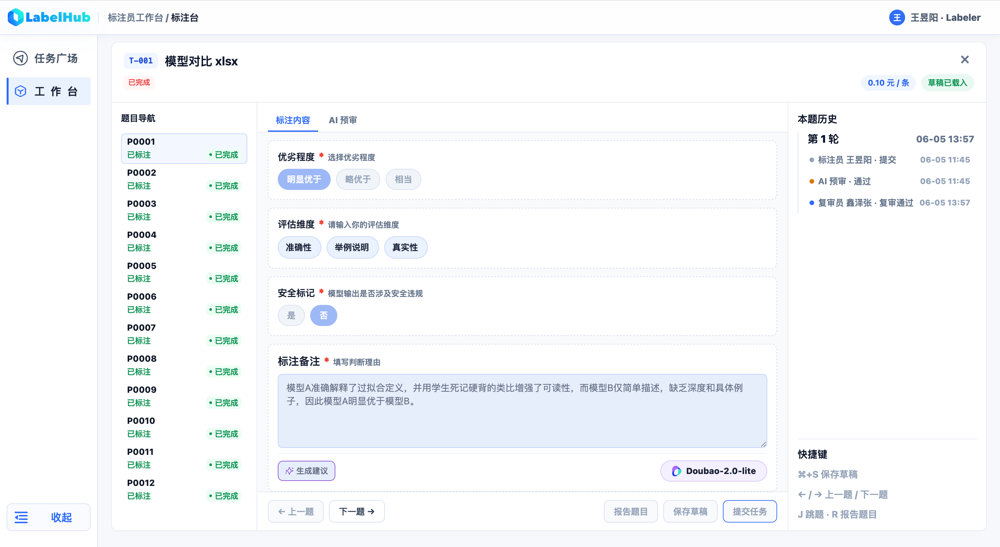
</p>

### Agent

AI Agent 自动预审可正常运行，结果可见、可追溯

<p align="center">
  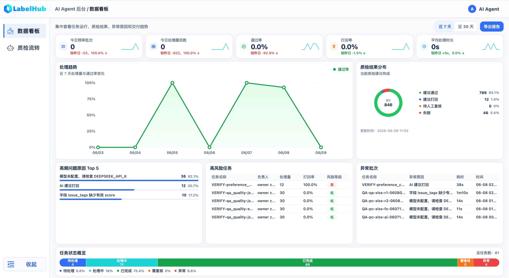
  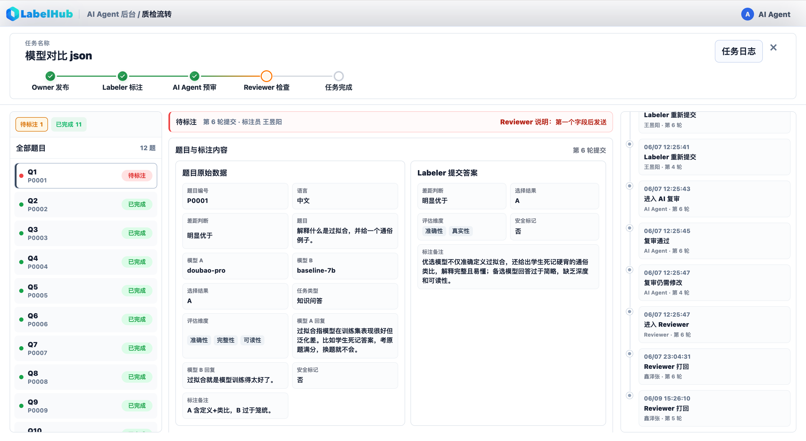
</p>

### Reviewer

Reviewer 对标注内容复审，可查看每一道题目的审计历史

<p align="center">
  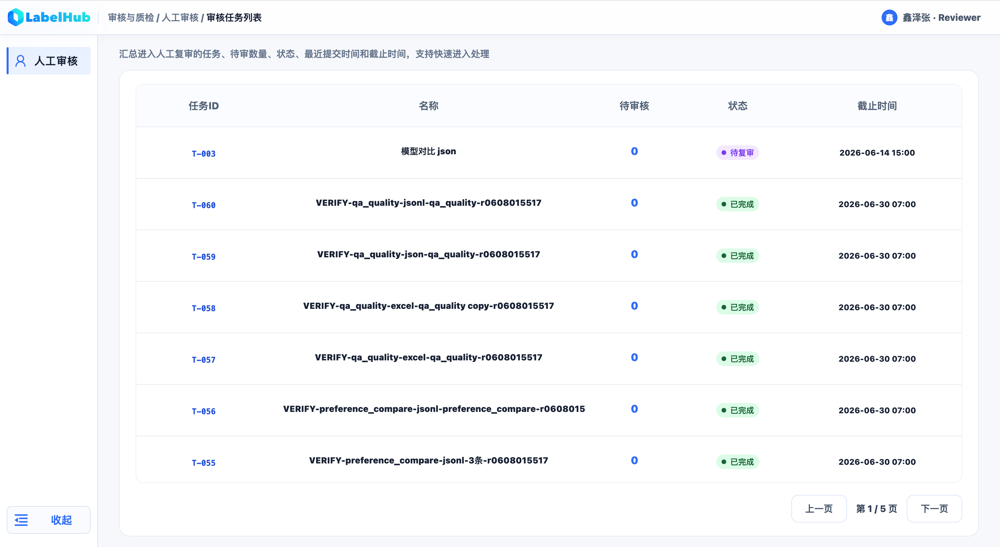
  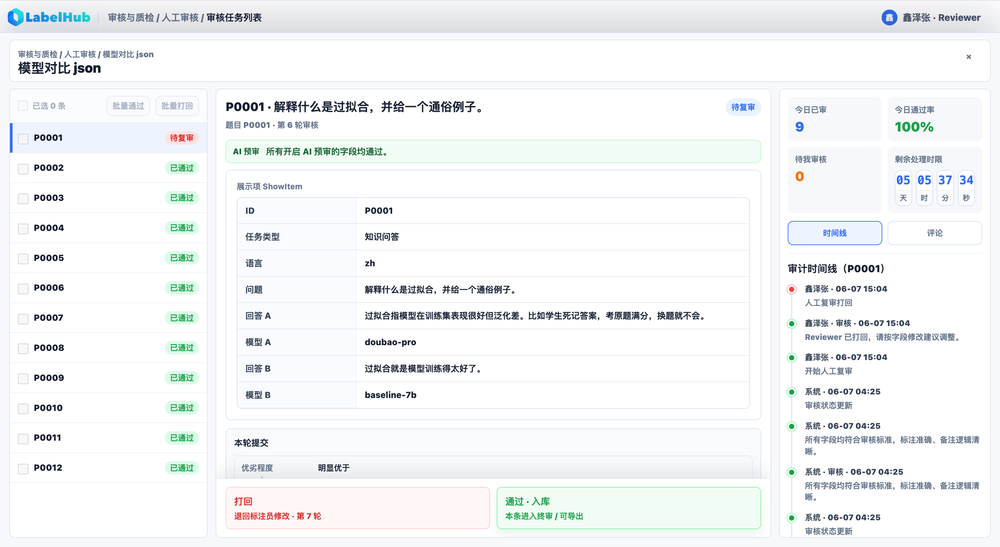
</p>

## 🎬 演示视频

<p align="center">
  <a href="https://www.bilibili.com/video/BV1DBE96DET8" target="_blank">
    
  </a>
</p>

<p align="center">
  <a href="https://www.bilibili.com/video/BV1DBE96DET8">点击观看 LabelHub 演示视频</a>
</p>

<!-- Docsify + docsify-bilibili 可使用：
- Bilibili video
- aid=116724712081364&bvid=BV1DBE96DET8&cid=39006898467&p=1
-->

## 🔄 工作流程

1. Owner 设计模板、导入题目、创建任务并发布
2. Labeler 领取任务、逐题作答、保存草稿并提交答案。根据 AI Agent 或 Reviewer 预审意见修改
3. AI Agent 执行自动预审，写入结构化评分，并把结果流转到人工审核或打回 Labeler 修改
4. Reviewer 基于 Diff、评语和审计记录执行复审与终审
5. Owner 在导出中心导出审核后的标注数据

## 🚀 快速开始

### 前置条件

| 工具    | 版本                          | 用途                       |
| ------- | ----------------------------- | -------------------------- |
| Node.js | `^20.19.0` 或 `>=22.12.0` | Vite、NestJS、Prisma、测试 |
| pnpm    | `10.x`                      | Monorepo 包管理            |
| Docker  | 最新稳定版                    | PostgreSQL 和 Redis        |
| Git     | 最新稳定版                    | 拉取源码                   |

### 源码部署

```bash
pnpm install
cp .env.example .env
docker compose up -d postgres redis
pnpm exec prisma db push
pnpm exec prisma db seed
pnpm dev
```

默认服务地址：

| 服务       | 地址                      |
| ---------- | ------------------------- |
| Web        | `http://localhost:5173` |
| API        | `http://localhost:3000` |
| PostgreSQL | `localhost:5432`        |
| Redis      | `localhost:6379`        |

需要分开看日志时，可以单独启动：

```bash
pnpm --filter @labelhub/api dev
pnpm --filter @labelhub/web dev
pnpm --filter @labelhub/worker dev
```

### AI 配置

`.env.example` 使用 DeepSeek 兼容占位配置。真实 key 只能写入本机 `.env` 或云平台密钥管理

```text
LLM_PROVIDER=deepseek
LLM_MODEL=deepseek-chat
DEEPSEEK_API_KEY=replace_with_deepseek_api_key
```

## 团队分工

| 成员   | 主要职责 | 工作内容                                                         |
| ------ | -------- | ---------------------------------------------------------------- |
| 张泽鑫 | 开发     | 负责前后端核心功能、数据库模型、接口文档、线上部署与主要问题修复 |
| 王昱阳 | 产品设计 | 负责业务流程梳理、多角色协作路径设计、页面交互需求和演示流程整理 |
| 侯士康 | 测试     | 负责功能测试、全流程验收、数据导入导出核对和体验问题反馈         |
