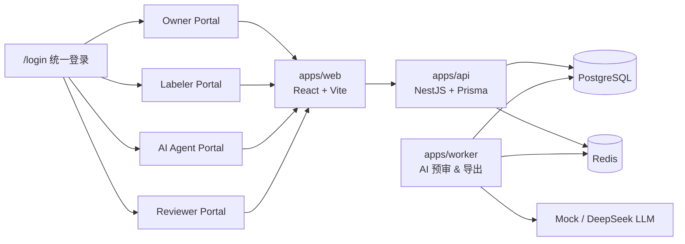
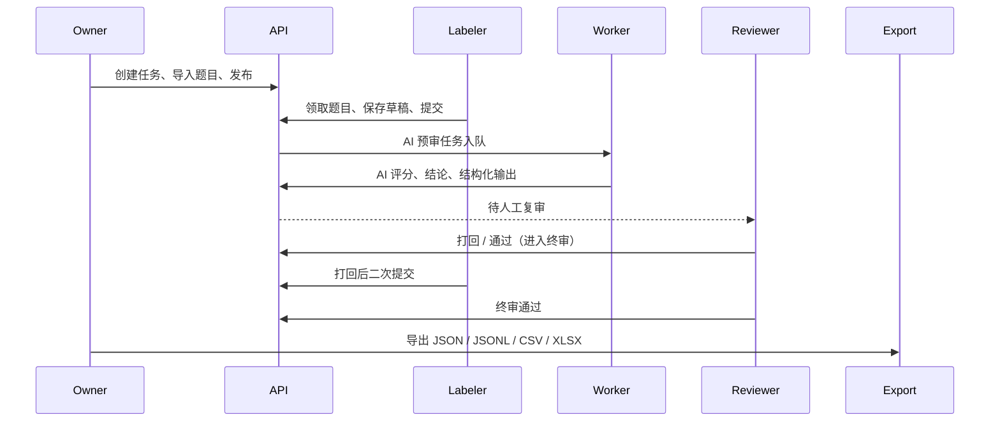

<p align="center">
  
</p>

<p align="center">
  <a href="#"></a>
  <a href="#技术栈"></a>
  <a href="#技术栈"></a>
  <a href="#技术栈"></a>
  <a href="#技术栈"></a>
  <a href="LICENSE"></a>
</p>

<p align="center">
  <strong>面向 AI 数据标注、自动预审、人工复审与结果导出的全栈演示平台。</strong>
</p>

---

## 目录

- [概览](#概览)
- [核心能力](#核心能力)
- [截图预览](#截图预览)
- [系统架构](#系统架构)
- [技术栈](#技术栈)
- [目录结构](#目录结构)
- [快速开始](#快速开始)
- [演示账号](#演示账号)
- [数据与模板](#数据与模板)
- [常用命令](#常用命令)
- [文档索引](#文档索引)
- [安全约束](#安全约束)

## 概览

LabelHub 围绕 **任务负责人**、**标注员**、**AI Agent** 和 **人工审核员** 四类角色设计，覆盖从模板配置、题目导入、任务发布、标注提交、AI 自动预审、人工复审到数据导出的完整闭环。

AI 预审需要配置 LLM provider 和 API Key。本地开发需在 `.env` 中配置 DeepSeek（或其他兼容 provider）密钥；未配置真实密钥时 AI 预审任务会失败，不会回退 mock。

> 💡 LabelHub 是一个全栈 monorepo 项目，前后端均使用 TypeScript，采用 pnpm workspace 管理多包。

## 核心能力

| 模块 | 能力 |
| --- | --- |
| 🔐 统一登录 | `/login` 统一入口，按角色进入独立 Portal，前后端双重权限校验 |
| 🧩 动态模板配置 | 文件自动解析、ShowItem 表格展示、选项拖拽排序、字段联动、校验规则、分组容器、多 Tab 布局 |
| 🤖 LLM 辅助标注 | 单行/多行输入、标签选择可配置 LLM 提示，标注员一键生成建议答案 |
| 🧠 AI 自动预审 | 任务级配置审核 Prompt、评分维度与结构化输出，提交后进入 AI Agent 异步队列 |
| 👁️ 人工审核 | Reviewer 聚合待审任务，支持任务级详情、题目切换、审核统计、审计时间线和通过/打回/修订 |
| 📦 数据导入导出 | 支持 JSON、JSONL、CSV、XLSX 和 zip 导入；导出中心展示可导出批次，多格式一键下载 |
| 🎨 企业级 UI | 统一侧边栏、顶部栏、表格、空状态、toast、确认弹窗、抽屉和响应式布局 |

### 四端工作区

| 角色 | 入口 | 核心页面 |
| --- | --- | --- |
| 🏗️ Owner | `/owner/*` | 任务管理、模板配置、数据导入、AI 规则、导出中心 |
| ✏️ Labeler | `/labeler/*` | 任务广场、标注台、我的数据 |
| 🤖 AI Agent | `/agent/*` | AI 预审队列、结构化输出、Prompt 日志 |
| ✅ Reviewer | `/reviewer/*` | 人工复审、终审、Diff 对比、审计时间线 |

## 截图预览

<details open>
<summary>点击展开/收起截图</summary>

| Owner 任务管理 | Owner 模板配置 |
|:---:|:---:|
|  |  |

| Labeler 标注台 | AI Agent 预审 |
|:---:|:---:|
|  |  |

| Reviewer 验收 | Owner 导出中心 |
|:---:|:---:|
|  |  |

</details>

## 系统架构



### 数据流：从标注到导出



> 详细架构说明、状态机流转和 AI Agent 流程请参阅 [docs/architecture.md](docs/architecture.md)。

## 技术栈

| 层级 | 技术 |
| --- | --- |
| Monorepo | pnpm workspace |
| Web 前端 | React 19、TypeScript、Vite、React Router、Zustand、dnd-kit |
| API 后端 | NestJS、TypeScript、Prisma ORM |
| Worker | TypeScript、AI 预审与导出任务处理 |
| 数据库 | PostgreSQL |
| 队列 | Redis（BullMQ 协议结构） |
| 编辑器 | CKEditor 5、jsoneditor |
| 测试 | Vitest、Testing Library、Playwright |
| 文件处理 | ExcelJS、JSZip |

## 目录结构

```text
LabelHub/
├── apps/
│   ├── web/         # React Web，四端 Portal、模板配置、动态表单、审核页面
│   ├── api/         # NestJS API，认证、任务、模板、提交、审核、导出接口
│   └── worker/      # AI 预审与导出 Worker
├── packages/
│   └── shared/      # Schema、状态机、Prompt 编译、角色与共享协议
├── prisma/
│   ├── schema.prisma
│   ├── seed.ts          # 演示数据种子
│   └── demo-reset.ts    # 演示数据重置
├── docs/
│   ├── architecture.md  # 架构说明与状态机
│   ├── deployment.md    # 部署说明
│   ├── demo-data.md     # 演示数据说明
│   └── demo-script.md   # 答辩演示脚本
├── submission/          # 提交材料与截图
└── tests/               # E2E 测试
```

## 快速开始

### 前置条件

- Node.js ≥ 18
- pnpm ≥ 10
- Docker & Docker Compose
- Git

### 1. 安装依赖

```bash
pnpm install
```

### 2. 配置环境变量

```bash
cp .env.example .env
```

> 本地开发时，在 `.env` 中配置 `LLM_PROVIDER=deepseek` 和真实 `DEEPSEEK_API_KEY` 以启用 AI 预审。环境变量参考 [docs/deployment.md#环境变量](docs/deployment.md#环境变量)。**不要提交真实密钥到仓库。**

### 3. 启动基础设施

```bash
docker compose up -d postgres redis
docker compose ps
```

### 4. 初始化数据库

```bash
pnpm exec prisma db push
pnpm exec prisma db seed
```

### 5. 启动应用

```bash
# 同时启动所有服务
pnpm dev

# 或分别启动
pnpm --filter @labelhub/api dev
pnpm --filter @labelhub/web dev
pnpm --filter @labelhub/worker dev
```

### 默认地址

| 服务 | 地址 |
| --- | --- |
| 🌐 Web | `http://localhost:5173` |
| 🔌 API | `http://localhost:3000` |
| 🗄️ PostgreSQL | `localhost:5432` |
| 📨 Redis | `localhost:6379` |

## 演示账号

> 所有演示账号统一密码：`123456`

| 账号 | 姓名 | 角色 | 默认首页 |
| --- | --- | --- | --- |
| `zhangman` | 张满 | 🏗️ Owner（任务负责人） | `/owner/tasks` |
| `lilei` | 李雷 | ✏️ Labeler（标注员） | `/labeler/market` |
| `hanmeimei` | 韩梅梅 | ✏️ Labeler（标注员） | `/labeler/market` |
| `agent` | 系统机审 | 🤖 AI Agent（质检） | `/agent/dashboard` |
| `wangfang` | 王芳 | ✅ Reviewer（审核员） | `/reviewer/reviews` |

API 登录示例：

```bash
curl -X POST http://localhost:3000/auth/login \
  -H "Content-Type: application/json" \
  -d '{"account":"zhangman","password":"123456"}'
```

## 数据与模板

### 支持的数据结构

| Profile | 说明 | 题目数 | 典型场景 |
| --- | --- | --- | --- |
| `qa_quality` | 问答质量评估 | 30 | 评估模型回答的多维度质量 |
| `preference_compare` | A/B 偏好对比 | 12 | 对比两个候选回答的偏好 |
| `generic_json` | 通用 JSON | 不限 | 自定义结构化数据 |

### 导入规则

- **格式支持**：JSON、JSONL、CSV、XLSX、zip
- **zip 导入**：自动忽略 `__MACOSX/`、`.DS_Store`、`._*`、`.~*.xlsx`
- **Excel 归一化**：`tags` / `dimensions` 字段使用 ` | ` 拆分为数组；`是/否` 归一化为布尔值

### 演示数据

运行 `pnpm exec prisma db seed` 或 `pnpm demo:reset` 后会生成：

- 4 个演示用户（四类角色）
- 2 个已发布官方模板
- 2 个进行中任务（共 42 条题目）
- 完整的三级审核链路示例数据（AI 预审 → 人工复审 → 终审）

## 常用命令

| 命令 | 说明 |
| --- | --- |
| `pnpm dev` | 启动所有服务（web + api + worker） |
| `pnpm typecheck` | 全项目类型检查 |
| `pnpm test` | 运行单元测试 |
| `pnpm test:e2e` | 运行 Playwright E2E 测试 |
| `pnpm exec prisma db seed` | 写入演示数据 |
| `pnpm demo:reset` | 清空并重建演示数据 |
| `pnpm lint` | 代码规范检查 |
| `docker compose config` | 验证 Compose 配置 |

## 文档索引

| 文档 | 说明 |
| --- | --- |
| [docs/architecture.md](docs/architecture.md) | 系统架构、状态机、AI Agent 流程 |
| [docs/deployment.md](docs/deployment.md) | 本地与云平台部署说明 |
| [docs/demo-data.md](docs/demo-data.md) | 演示数据字段结构与导入规则 |
| [docs/demo-script.md](docs/demo-script.md) | 答辩演示脚本 |
| [docs/api/openapi.yaml](docs/api/openapi.yaml) | OpenAPI 3.0 接口文档 |
| [submission/README.md](submission/README.md) | 提交材料索引与截图 |

## 安全约束

以下内容**严禁**提交至仓库：

- `.env` 及其中真实 API Key
- 官方 `datasets.zip` 及解压数据
- `node_modules/`、构建产物、覆盖率报告
- Playwright 报告、临时导出文件

---

<p align="center">
  <sub>Built with TypeScript · React · NestJS · Prisma · PostgreSQL</sub>
</p>
