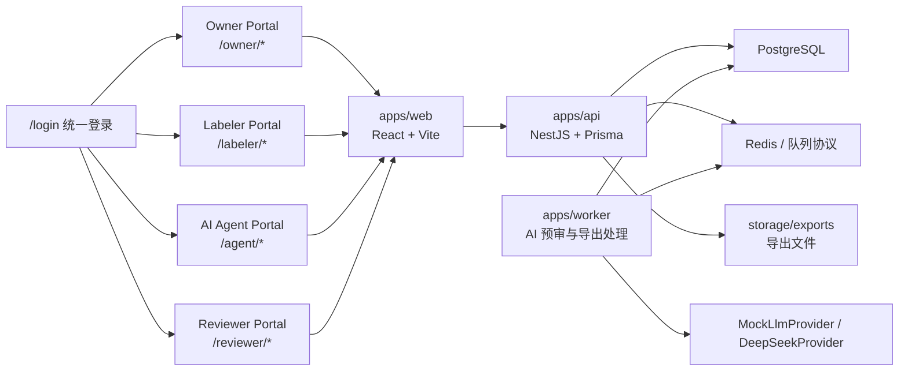
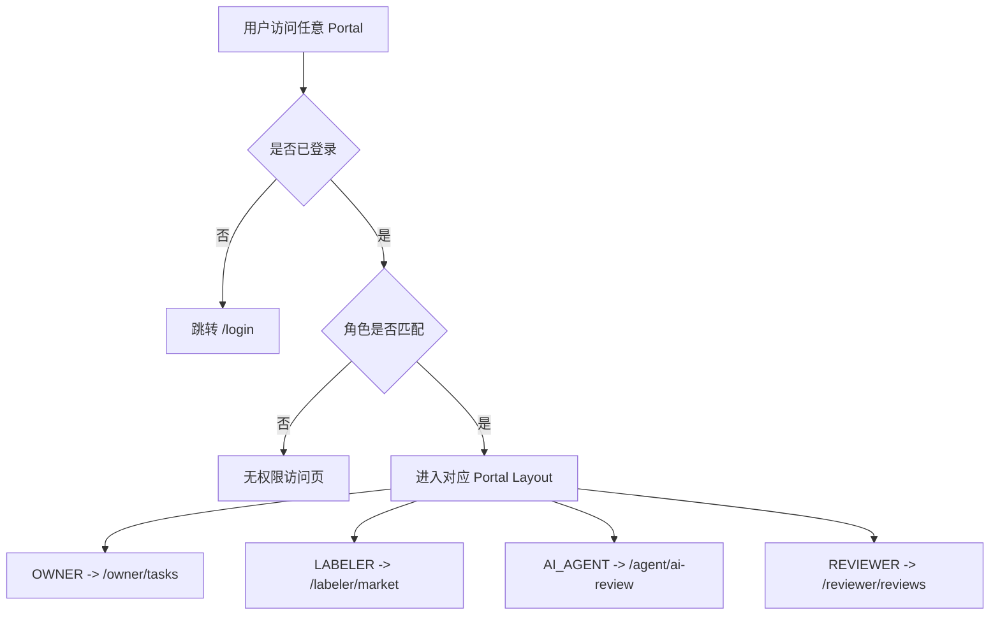
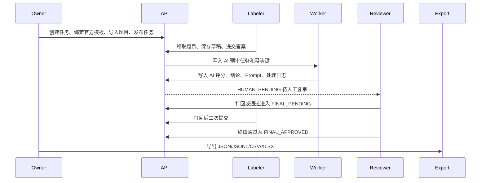
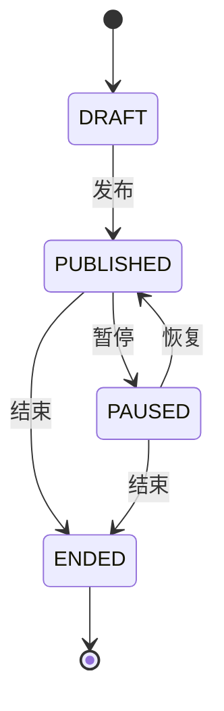
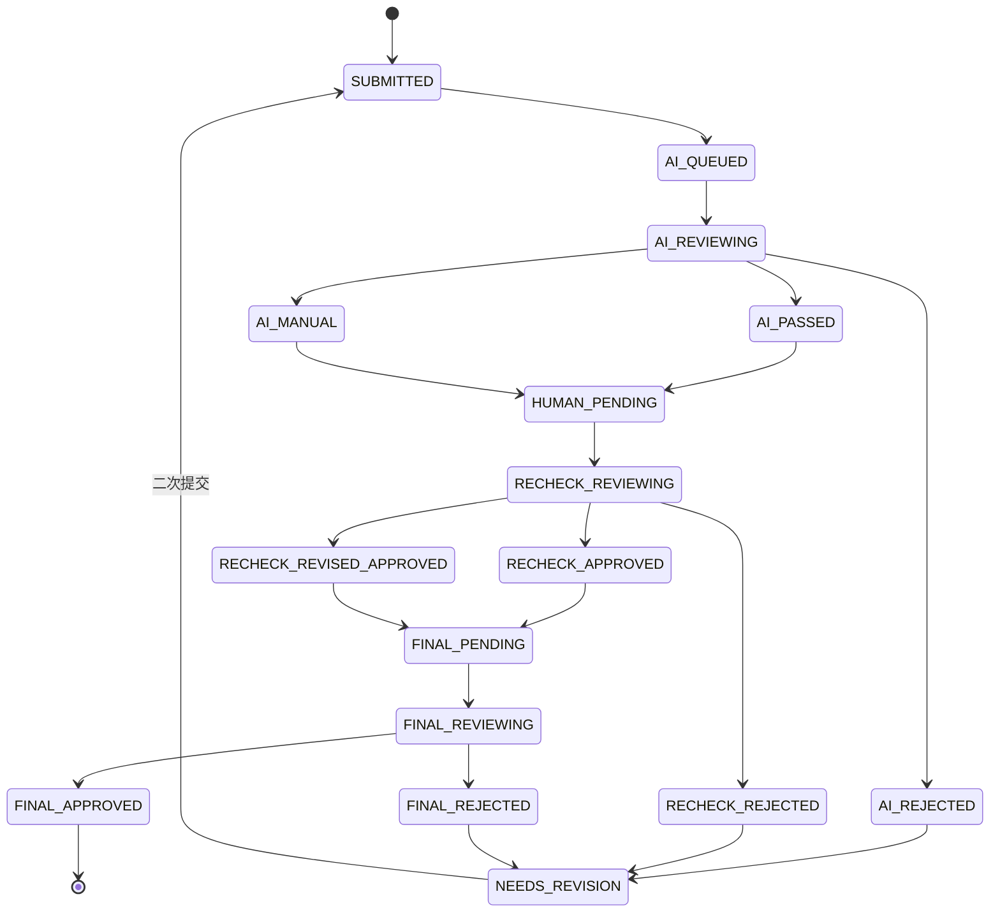
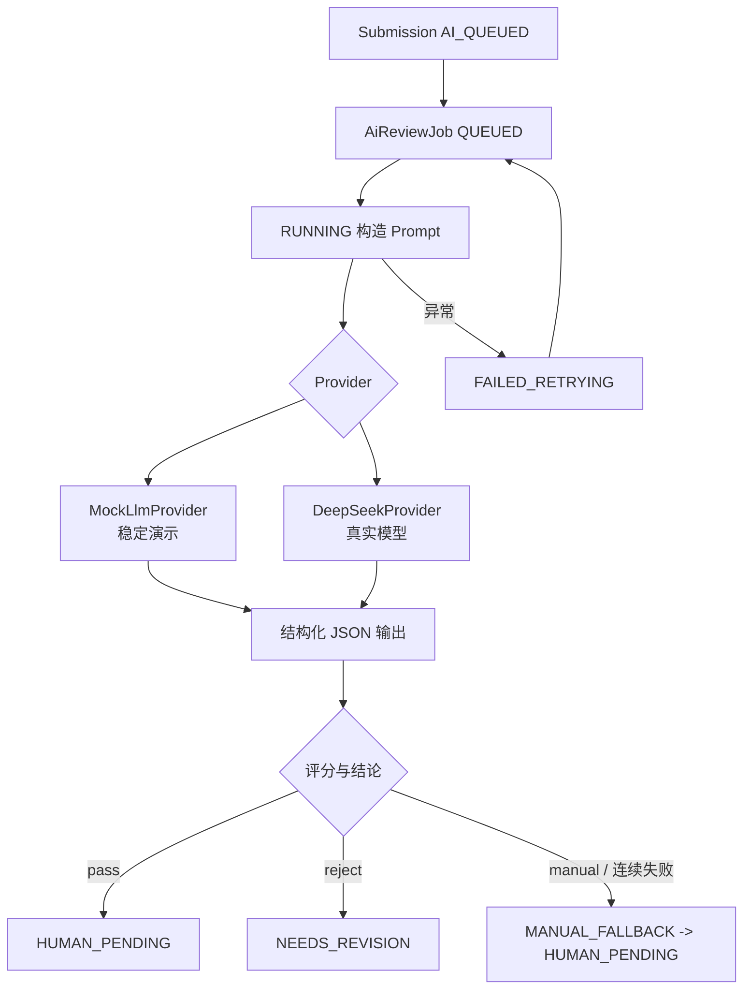
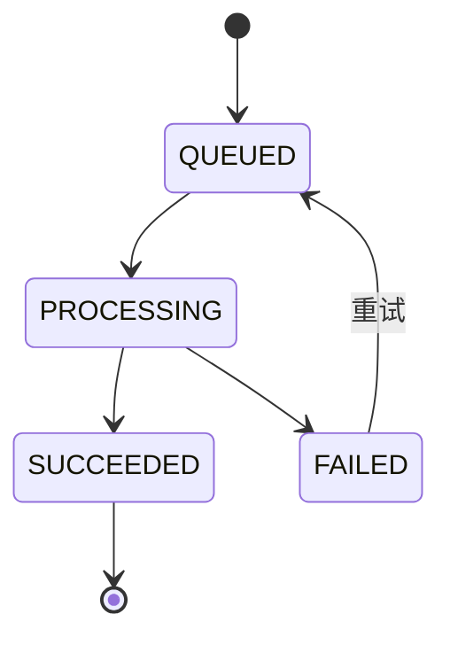

# LabelHub 架构说明

LabelHub 采用 pnpm monorepo，前端、后端、Worker 和共享协议分层明确。核心目标是让官方数据在统一登录、四端隔离、动态 Schema、AI 自动预审、人工复审、终审和导出中心之间形成可演示闭环。

## 目录

- [系统架构](#系统架构)
- [Monorepo 职责](#monorepo-职责)
- [四端隔离](#四端隔离)
- [数据流](#数据流)
- [任务状态机](#任务状态机)
- [提交与审核状态机](#提交与审核状态机)
- [AI Agent 流程](#ai-agent-流程)
- [导出状态机](#导出状态机)
- [五张视觉参考映射](#五张视觉参考映射)
- [三大工程难点](#三大工程难点)

## 系统架构

## Monorepo 职责

| 模块 | 职责 |
| --- | --- |
| `apps/web` | 四端 Portal、路由守卫、Designer、Renderer、复审台、导出中心 |
| `apps/api` | 登录、RBAC、任务管理、导入、草稿、提交、审核、导出和审计 |
| `apps/worker` | AI 预审处理器、LLM provider、导出处理器 |
| `packages/shared` | 角色、路由元数据、状态机、Schema runtime、DatasetProfile |
| `prisma` | 数据模型、官方演示 seed、demo reset |

## 四端隔离

前端路由守卫只负责体验和入口隔离，API 层仍必须按角色和资源关系校验。四个 Portal 使用独立 Layout、独立导航和独立页面目录，禁止用顶部角色切换模拟权限。

## 数据流

## 任务状态机

## 提交与审核状态机

关键约束：人工复审通过只能进入 `FINAL_PENDING`，不能直接入库；只有 `FINAL_APPROVED` 数据可被导出。

## AI Agent 流程

AI 处理保留 `function_calling` / JSON 结构化输出模式、幂等键、重试次数、Prompt、raw output、模型元数据和审计日志。

## 导出状态机

导出中心支持 `json`、`jsonl`、`csv`、`xlsx`，字段映射来自 `rawData`、`answers` 和审核记录。导出服务在预览和生成时都过滤 `FINAL_APPROVED`。

## 五张视觉参考映射

| 参考图 | 页面 | 结构要求 | 当前对应 |
| --- | --- | --- | --- |
| 图 1 Owner 任务发布 | `/owner/tasks` | 左侧导航、统计卡片、筛选区、任务表格、发布抽屉 | Owner 任务管理和任务状态机 |
| 图 2 Owner 模板配置 | `/owner/templates` 或 Designer 页面 | 物料区、画布、属性/校验/联动三栏、预览与发布 | 模板 Designer 与 Renderer 共用 Schema |
| 图 3 Labeler 标注台 | `/labeler/tasks/:taskId/items/:itemId` | 题目导航、表单、贡献/历史面板、底部操作区 | 草稿、提交、打回提示、LLM 辅助 |
| 图 4 AI Agent 机审 | `/agent/ai-review` | 队列、状态分组、结构化输出、Prompt、日志 | AI 预审队列、重试和人工兜底 |
| 图 5 Reviewer 验收 | `/reviewer/reviews` | 待审列表、批量操作、Diff、AI 评语、审计时间线 | 人工复审、终审、打回和第 1 / 2 轮 Diff |

E2E 已对这些核心页面做双视口截图（1280 / 1920）、中文文案扫描和横向溢出检查，文档与演示脚本沿用这五张图作为讲解主线。

## 三大工程难点

1. 动态表单：Designer 负责生成 JSON Schema，Renderer 按同一份 Schema 渲染展示项、输入项、单选、多选、标签、富文本、文件/图片、JSON 编辑器、分组、多 Tab、联动和 LLM 辅助。
2. 状态机与审计：任务、提交、AI 审核、人工审核、终审和导出都通过有限状态机收敛，关键动作写入 `audit_logs`。
3. AI Agent 工程化：提交后通过队列协议异步预审，provider 默认 mock，真实 DeepSeek 只读取环境变量；失败重试、人工兜底、结构化输出、幂等和模型元数据可追溯。
