# LabelHub 基础技术实现文档

## 0. 文档定位

本文面向技术评审、项目答辩和后续维护人员，系统梳理 LabelHub 项目中的基础技术实现。文档不按代码文件堆叠说明，而是从真实业务目标出发，解释每个核心模块为什么这样设计、底层如何实现、最终解决了什么问题。

当前项目是一个面向 AI 数据标注、自动预审、人工复审和结果导出的全栈演示平台。代码形态是 pnpm monorepo，包含：

- `apps/web`：React + Vite 前端，承载 Owner、Labeler、AI Agent、Reviewer 四端。
- `apps/api`：NestJS + Prisma 后端，承载模板、任务、提交、AI 预审、人工复审、导出等业务服务。
- `apps/worker`：队列 payload、AI 预审处理器、导出处理器和 LLM provider 封装。
- `packages/shared`：跨端共享的类型、状态机、Schema DSL、运行时、Prompt 编译器和数据集 Profile。
- `prisma`：数据库模型、枚举、唯一约束、索引和种子数据。

> 当前实现边界：旧版提交文档中曾描述 `FINAL_PENDING -> FINAL_REVIEWING -> FINAL_APPROVED` 终审链路；但当前共享状态机测试明确验证人工复审通过后直接进入 `FINAL_APPROVED`，因此本文以当前代码为准，不沿用旧链路。

---

## 1. Monorepo 与共享契约架构

### 设计思路

LabelHub 的关键难点不是单个页面复杂，而是同一套业务语义需要同时出现在前端、后端、测试和导出链路中。例如字段类型、状态枚举、路由权限、Schema 校验、状态流转，如果分散定义，很容易出现“前端能提交、后端不认可”或“文档状态与代码状态不一致”的问题。

因此项目把跨端稳定语义集中到 `packages/shared`，让前端和后端都依赖同一份契约。

### 实现方案

- `packages/shared/src/schema.ts` 定义数据集类型、字段类型、Schema DSL、字段联动规则和 AI 审核配置。
- `packages/shared/src/stateMachines.ts` 定义任务、提交、AI 审核、人工审核、导出状态机。
- `packages/shared/src/routes.ts` 与 `rbac.ts` 定义四端路由权限。
- `packages/shared/src/datasetProfiles.ts` 定义不同数据集的必需字段、支持格式和归一化逻辑。
- `packages/shared/src/aiReviewPrompt.ts` 负责从 Schema DSL 编译 AI 预审 Prompt。

### 最终效果

- 前端渲染、后端校验、AI Prompt 编译、导出字段映射共享同一套核心定义。
- 状态、字段和路由语义集中维护，降低模块间漂移。
- 测试可以直接覆盖共享契约，避免只测 UI 表象。

### 关键代码

- `packages/shared/src/schema.ts:204`
- `packages/shared/src/stateMachines.ts:21`
- `packages/shared/src/routes.ts:19`
- `packages/shared/src/datasetProfiles.ts:22`
- `packages/shared/src/aiReviewPrompt.ts:69`

### 架构图

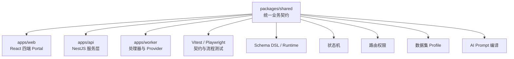

---

## 2. 四端 Portal 与 RBAC 路由隔离

### 设计思路

项目有四类角色：Owner、Labeler、AI Agent、Reviewer。它们操作同一批任务数据，但关注点完全不同。如果共用一套页面入口，会导致导航复杂、权限边界模糊、演示流程不清晰。

因此前端采用四端 Portal 隔离：统一登录后按角色进入不同路由前缀，每个端只暴露本角色需要的功能。

### 实现方案

- `PORTAL_ROUTE_PREFIX` 把角色映射到 `/owner`、`/labeler`、`/agent`、`/reviewer`。
- `ROUTE_PERMISSIONS` 声明每个 Portal 允许访问的角色、默认首页和导航名。
- `canAccessRoute` 通过路由前缀判断当前角色是否允许访问。
- Playwright E2E 覆盖四端路由隔离和无权限拦截。

### 最终效果

- 用户登录后按角色进入对应工作台。
- 错误角色访问其他端时被明确拦截。
- 演示和答辩时可以清晰展示四个角色的闭环协作。

### 关键代码

- `packages/shared/src/routes.ts:3`
- `packages/shared/src/routes.ts:19`
- `packages/shared/src/rbac.ts:4`
- `tests/e2e/quality-hardening.spec.ts:11`

### 流程图

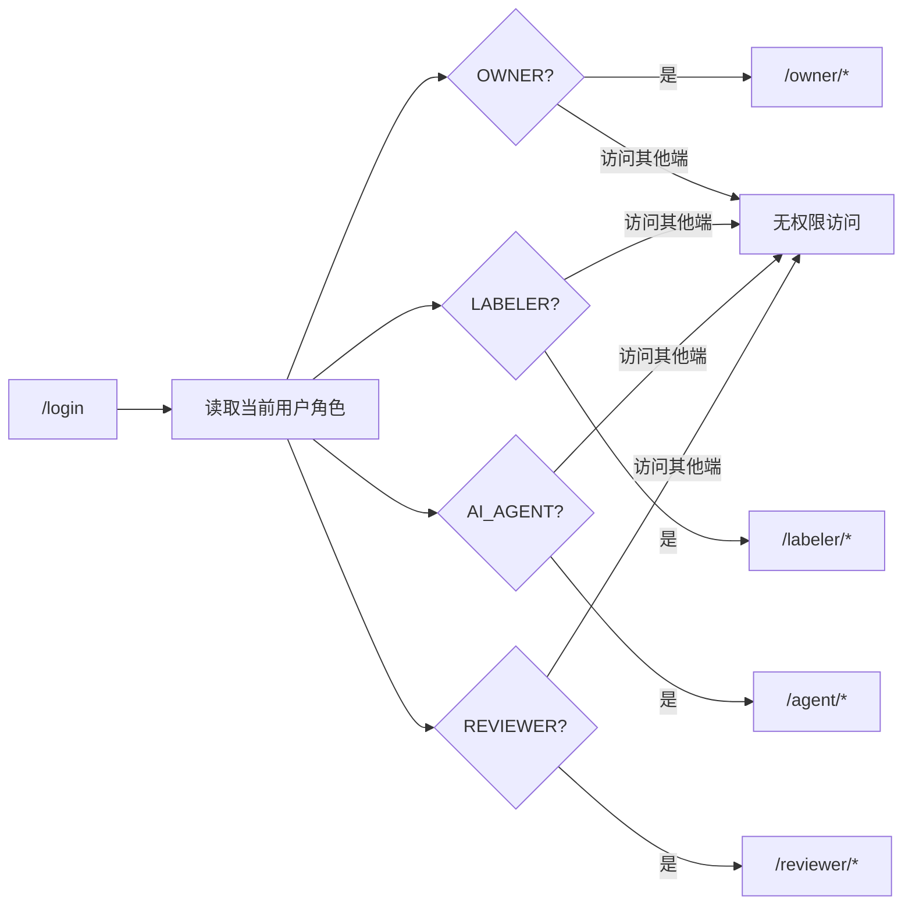

---

## 3. 基于 Schema DSL 的动态表单架构

### 设计思路

标注任务的核心差异在于字段结构、展示材料、答案类型、校验规则和联动逻辑。如果为 `qa_quality`、`preference_compare` 等任务分别硬编码页面，后续每增加一种标注任务都要重新开发前端页面、后端校验和导出逻辑。

项目采用 Schema DSL，把“表单长什么样、字段如何校验、哪些字段参与 AI 审核、展示哪些原始数据”抽象为可执行配置。前端设计器负责生成 DSL，前端渲染器和后端服务共同解释 DSL。

### 实现方案

Schema DSL 的核心结构包括：

- `LabelHubSchema`：模板根对象，包含 `schemaVersion`、`datasetKind`、`fields`、`linkageRules`、`aiReviewPrompt`。
- `SchemaField`：字段定义，支持 `show_item`、`text`、`textarea`、`radio`、`checkbox`、`tag_select`、`rich_text`、`file_upload`、`image_upload`、`json_editor`、`llm_assist`、`group`、`tabs`。
- `FieldValidation`：字段必填、长度、正则、自定义校验。
- `FieldAiReviewConfig`：字段级 AI 审核角色和审核要求。

运行链路：

1. Owner 在模板设计器中拖拽物料、配置字段、规则和 AI 审核要求。
2. 设计器将操作转化为 `LabelHubSchema`。
3. Labeler 标注时，`SchemaRenderer` 读取 Schema 并动态渲染表单。
4. 前端每次字段变化都调用 `applySchemaLinkage` 重新计算可见性、必填、禁用、选项限制和自动赋值。
5. 后端提交时通过 `SchemaService.validate` 复用同一套 runtime 校验答案。

### 最终效果

- 增加新任务类型时优先配置模板，而不是新增页面。
- 设计态、答题态、审核态和后端校验使用同一套语义。
- 动态表单不仅支持渲染，还支持联动、校验、AI 审核和导出。

### 关键代码

- `packages/shared/src/schema.ts:175`
- `packages/shared/src/schema.ts:204`
- `apps/web/src/features/template-designer/templateStore.ts:37`
- `apps/web/src/features/schema-renderer/SchemaRenderer.tsx:63`
- `apps/api/src/schema/schema.service.ts:21`

### 数据流图

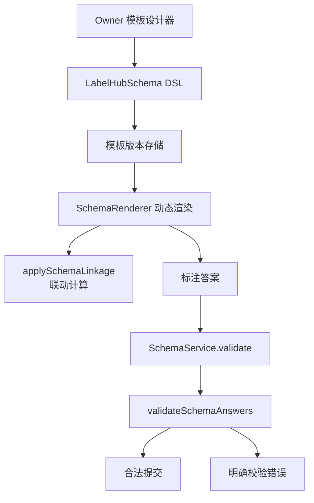

---

## 4. 规则 DSL 与字段联动引擎

### 设计思路

动态表单真正复杂的部分不是字段渲染，而是字段之间的条件关系。例如：

- 当“是否存在风险”为是时显示“风险说明”。
- 当“偏好选择”为 A 时限制“优劣程度”的可选项。
- 当某字段满足条件时自动设置另一个字段值。

如果这些逻辑散落在组件事件里，无法复用、无法验证、无法给后端解释。因此项目把字段联动抽象为规则 DSL。

### 实现方案

规则 DSL 分为两层：

1. 结构化规则层：`StructuredFieldLinkageRule`
   - `conditions` 表示条件数组。
   - `combinator` 表示 `and` / `or`。
   - `actions` 表示动作数组，支持 `show`、`hide`、`limitOptions`、`require`、`disable`、`setValue`、`assertValue`。

2. 可视化编辑层：Rule Editor AST
   - `LinkageRuleEditorNode` 把规则拆成关键词、字段引用、操作符、字面量和动作选项。
   - `ruleEditorSerializer` 把结构化规则转为可编辑节点。
   - `ruleEditorParser` 把编辑器节点解析回结构化规则。
   - 单测验证 AST -> nodes -> AST 往返不丢语义。

运行时由 `applySchemaLinkage` 执行规则：

- 收集 schema 根级规则和字段级规则。
- 展开 legacy rule 与 structured rule。
- 判断条件命中。
- 应用动作：显示、隐藏、必填、禁用、限制选项、自动赋值、断言错误。
- 删除隐藏字段答案，生成 `normalizedAnswers`。

### 最终效果

- Owner 可以用接近自然语言的方式配置复杂联动。
- 规则底层仍是结构化 AST，可以测试和复用。
- 前端渲染和后端校验共享同一个联动运行时。

### 关键代码

- `packages/shared/src/schema.ts:88`
- `apps/web/src/features/template-designer/rule-editor/ruleEditorAst.ts:16`
- `apps/web/src/features/template-designer/rule-editor/ruleEditorSerializer.ts:44`
- `apps/web/src/features/template-designer/rule-editor/ruleEditorParser.ts:141`
- `packages/shared/src/schemaRuntime.ts:122`
- `packages/shared/src/schemaRuntime.ts:340`
- `apps/web/src/features/template-designer/rule-editor/ruleEditorParser.test.ts:36`

### 规则执行图

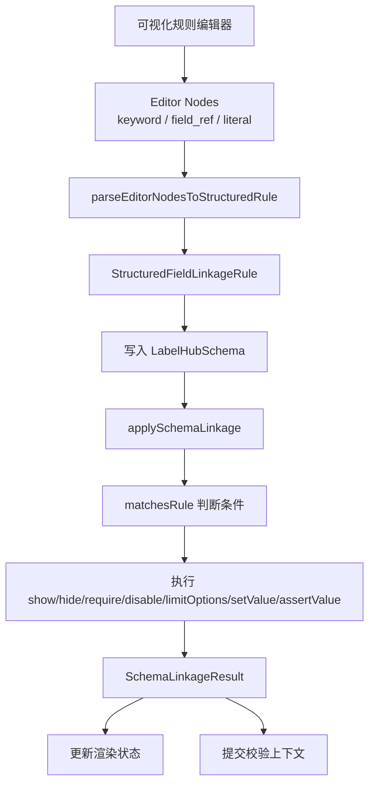

---

## 5. 模板版本、兼容性与差异检测

### 设计思路

模板一旦被任务使用，就不能随意修改，否则历史提交可能无法展示或导出。因此模板需要版本化：草稿可以编辑，发布后冻结为版本，后续变更通过新版本承载。

同时，模板升级不是简单改字段名。删除字段、修改字段类型、修改 AI Prompt 都会影响历史数据和审核行为，所以需要兼容性报告和版本差异。

### 实现方案

- 发布时要求当前模板处于 `DRAFT`。
- 发布前调用 `assertValidTemplateSchema` 校验 Schema。
- 发布后写入递增 `version` 和 `schemaVersion`。
- 如果存在父模板，则调用 `buildTemplateCompatibilityReport` 比较新旧 Schema。
- `buildTemplateVersionDiff` 对字段新增、删除、标签、类型、必填、选项、展示配置、AI Prompt 变化进行分类。
- 使用中的模板删除时归档，而不是直接物理删除。

### 最终效果

- 任务使用的模板版本稳定可追溯。
- 模板升级风险可见，便于 Owner 判断是否兼容历史数据。
- 历史提交通过 `schemaVersion` 能知道当时使用的表单语义。

### 关键代码

- `apps/api/src/templates/templates.service.ts:240`
- `packages/shared/src/templateValidation.ts:83`
- `packages/shared/src/templateValidation.ts:202`
- `apps/api/src/templates/templates.service.ts:608`

### 生命周期图

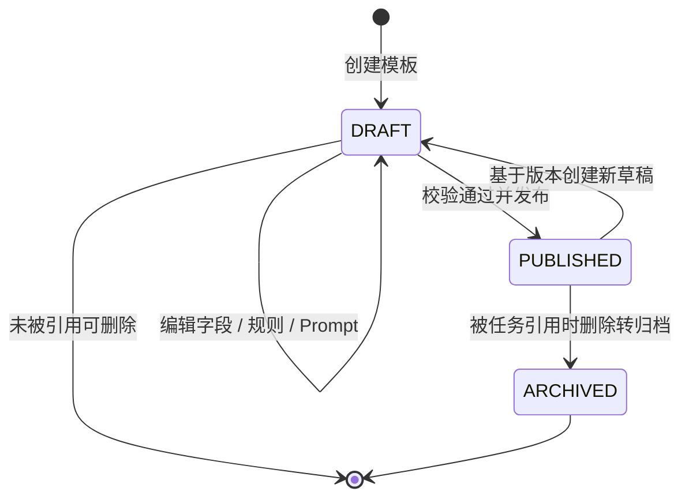

---

## 6. 数据集 Profile 与导入归一化

### 设计思路

标注平台不能只支持一种固定输入。实际数据可能来自 JSON、JSONL、CSV、Excel 或 zip 包；不同任务类型对字段要求也不同。例如问答质量需要 `prompt` 和 `model_answer`，偏好对比需要 `response_a` 和 `response_b`。

因此项目把“数据集类型的字段要求”抽象成 Dataset Profile，再让导入器按格式解析、按 Profile 校验和归一化。

### 实现方案

- `datasetProfiles.ts` 定义每类数据集的主键字段、必填字段、支持格式、数组字段、布尔字段、媒体字段。
- `parseDatasetImport` 根据格式分发到 JSON、JSONL、CSV、XLSX 解析器。
- `parseDatasetZipImport` 遍历 zip 内文件，自动跳过目录、系统临时文件和无法识别的文件。
- JSONL 按行解析并记录行号错误。
- CSV 使用自定义状态机处理引号、逗号、换行。
- Excel 使用 `exceljs` 读取目标 sheet。
- 归一化时将 `|` 分隔字段转数组，将中文 `是/否` 转布尔值。

### 最终效果

- 支持多格式数据导入。
- 错误定位到文件、行号或字段。
- 系统不会用 mock 值填补缺失字段，而是返回明确错误。
- 数据进入任务前已经归一化，后续模板渲染和导出更稳定。

### 关键代码

- `packages/shared/src/datasetProfiles.ts:22`
- `packages/shared/src/datasetProfiles.ts:79`
- `packages/shared/src/datasetProfiles.ts:129`
- `apps/api/src/datasets/importers/dataset-importer.ts:63`
- `apps/api/src/datasets/importers/dataset-importer.ts:96`
- `apps/api/src/datasets/importers/dataset-importer.ts:211`
- `apps/api/src/datasets/importers/dataset-importer.ts:326`

### 导入流程图

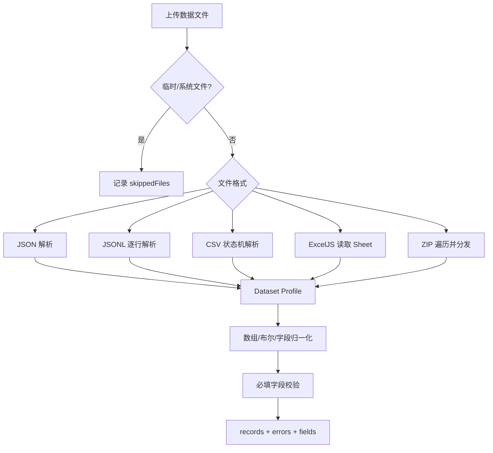

---

## 7. 标注提交、草稿与事务一致性

### 设计思路

标注提交不是简单保存答案。一次提交会影响提交记录、领取状态、题目状态、审计日志、AI 预审任务等多个表。如果这些操作分散执行，中途失败就可能产生脏状态。

因此提交链路采用事务包裹，并在写入前完成 Schema 校验和幂等判断。

### 实现方案

- `submit` 提交单个 assignment。
- `submitTask` 支持任务级批量提交多个 assignment。
- 提交前统一调用 `SchemaService.validate`，不合法答案直接抛 `SUBMISSION_SCHEMA_INVALID`。
- 如果提供幂等键，先查已有提交，存在则直接返回已有提交。
- 创建提交后同步更新 assignment 和 task item 状态。
- 如果任务开启 AI 预审，创建 `AiReviewJob`；否则提交直接进入 `HUMAN_PENDING`。
- 如果 AI 预审开启但真实模型配置不可用，抛出 `AI_REVIEW_MODEL_NOT_CONFIGURED`，不静默回退 mock。

### 最终效果

- 提交链路具备原子性。
- 重复提交请求不会重复生成业务结果。
- AI 预审配置错误在提交阶段暴露，便于定位。
- 标注答案进入数据库前已经经过共享 Schema runtime 校验。

### 关键代码

- `apps/api/src/submissions/submissions.service.ts:243`
- `apps/api/src/submissions/submissions.service.ts:251`
- `apps/api/src/submissions/submissions.service.ts:272`
- `apps/api/src/submissions/submissions.service.ts:443`
- `apps/api/src/submissions/submissions.service.ts:459`
- `apps/api/src/submissions/submissions.service.ts:499`

### 时序图

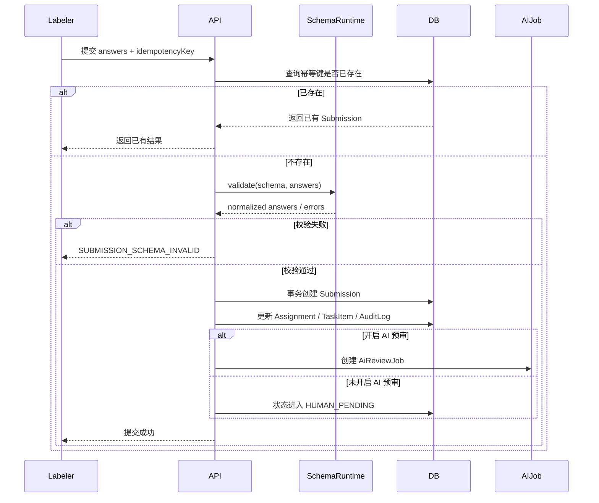

---

## 8. 状态机正确性与审计追踪

### 设计思路

项目中任务、提交、AI 预审、人工复审和导出都有生命周期。如果状态跳转只靠服务层临时判断，很容易出现非法状态，例如已完成任务重新发布、导出从排队直接成功、提交跳过 AI 审核等。

项目将状态流转显式建模为状态机，并用断言函数在服务层执行关键动作前校验。非法跳转直接抛错，不做兜底。

### 实现方案

- `TASK_TRANSITIONS` 约束任务从草稿到发布、暂停、结束。
- `SUBMISSION_TRANSITIONS` 约束提交从草稿、提交、AI 预审、人工复审、返修到最终通过。
- `AI_REVIEW_TRANSITIONS` 约束 AI 任务从排队、运行、成功、失败重试、最终失败、人工兜底。
- `EXPORT_TRANSITIONS` 约束导出任务从排队、处理、成功、失败、重试。
- `assertTransition` 对非法跳转抛出中文错误。
- `StateMachineService` 在 NestJS 中封装共享状态机。
- 关键服务在事务内写入 `fromStatus`、`toStatus`、`actorId`、`reason`、`metadata` 审计日志。

### 最终效果

- 状态流转可以被测试、审计和解释。
- 非法流程不会被静默修正。
- 审计日志能还原每次业务动作和状态变化。

### 关键代码

- `packages/shared/src/stateMachines.ts:21`
- `packages/shared/src/stateMachines.ts:95`
- `apps/api/src/state-machine/state-machine.service.ts:21`
- `apps/api/src/tasks/tasks.service.ts:364`
- `apps/api/src/ai-review/ai-review.service.ts:507`
- `apps/api/src/audit/audit.service.ts:31`
- `packages/shared/src/stateMachines.test.ts:21`

### 状态机图

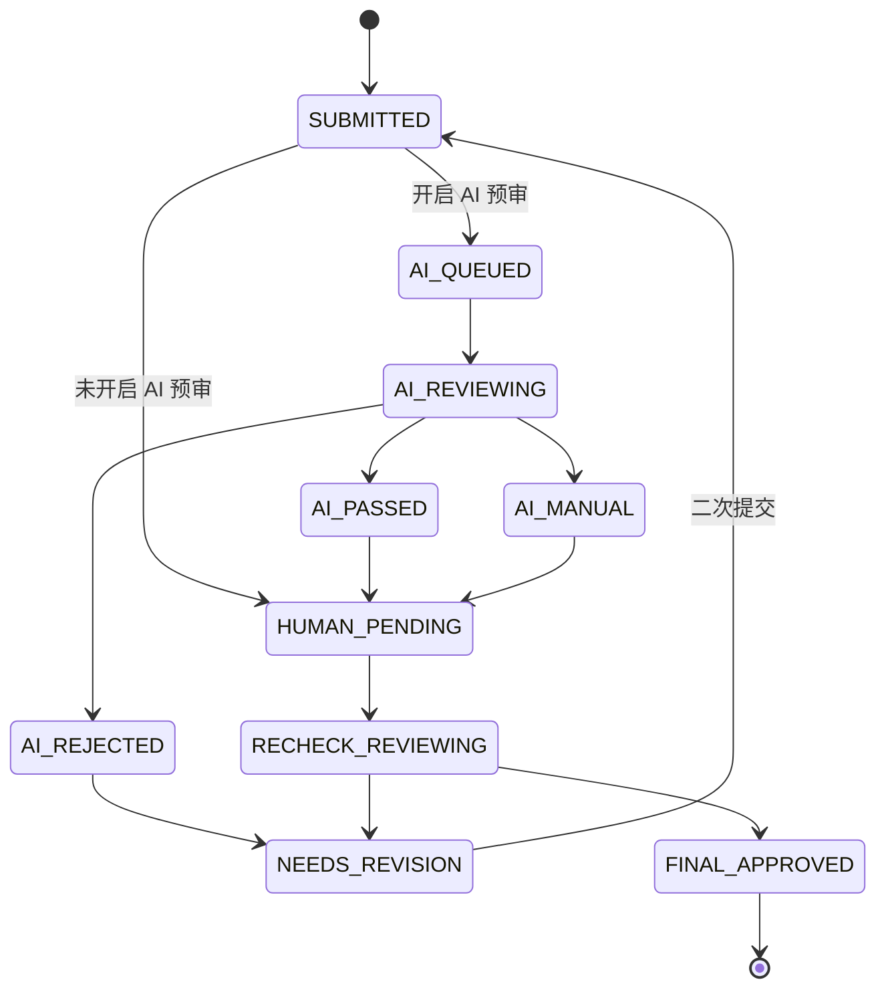

---

## 9. AI Agent 工程化：Prompt 编译、结构化输出、幂等与重试

### 设计思路

AI 预审不能只是“调用一次大模型”。大模型输出不稳定，接口可能失败，重复请求可能产生重复审核记录，Prompt 也需要随模板字段变化而变化。

项目把 AI Agent 预审设计为工程化链路：

- 从 Schema DSL 编译 Prompt。
- 使用结构化 JSON 输出约束模型。
- 记录 provider、model、requestId、token、延迟、structuredOutputMode。
- 用幂等键保证同一提交同一轮 AI 预审只对应一条业务链路。
- 用 job 状态和 attempts 管理失败、重试和最终失败。

### 实现方案

当前真实运行链路以 API 侧 `AiReviewProcessorService` 轮询处理为主：

1. 提交创建时生成 `AiReviewJob`，幂等键为 `${submissionId}:${round}:ai-review`。
2. Processor 定时扫描 `QUEUED` 和 `FAILED_RETRYING` 任务。
3. `claimQueuedJob` 使用 `updateMany` 限定当前 job id 和 status，只有一个处理器能成功 claim。
4. 读取提交详情和当前启用的 ReviewRule。
5. 如果任务存在模板 Schema，调用 `compileAiReviewPrompt` 从 Schema、ShowItem、answers 和字段审核要求编译 Prompt。
6. `LlmService.reviewSubmission` 调用真实 provider；如果 provider 仍是 mock，直接抛 `AI_REVIEW_PROVIDER_MOCK`。
7. 模型返回后写入 ReviewRecord，包括 rawPrompt、rawOutput、structuredOutput、modelMetadata、retryCount、idempotencyKey。
8. 根据 pass / reject 更新提交状态并写入审计。
9. 失败时进入 `FAILED_RETRYING` 或 `FAILED_FINAL`，可手动 retry。

### 最终效果

- AI 预审结果可追踪、可重试、可审计。
- 重复请求不会重复写入提交、AI job 或 review record。
- 模型配置缺失、mock provider、模型响应缺少内容都会明确抛错。
- Prompt 与模板字段绑定，避免人工维护多份 Prompt。

### 关键代码

- `apps/api/src/common/idempotency/idempotency-key.ts:19`
- `apps/api/src/submissions/submissions.service.ts:499`
- `apps/api/src/ai-review/ai-review-processor.service.ts:131`
- `apps/api/src/ai-review/ai-review-processor.service.ts:191`
- `apps/api/src/ai-review/ai-review-processor.service.ts:245`
- `packages/shared/src/aiReviewPrompt.ts:69`
- `apps/api/src/llm/llm.service.ts:74`
- `apps/api/src/llm/llm.service.ts:544`
- `apps/api/src/ai-review/ai-review.service.ts:474`
- `apps/api/src/ai-review/ai-review.service.ts:606`
- `prisma/schema.prisma:345`

### AI Agent 时序图

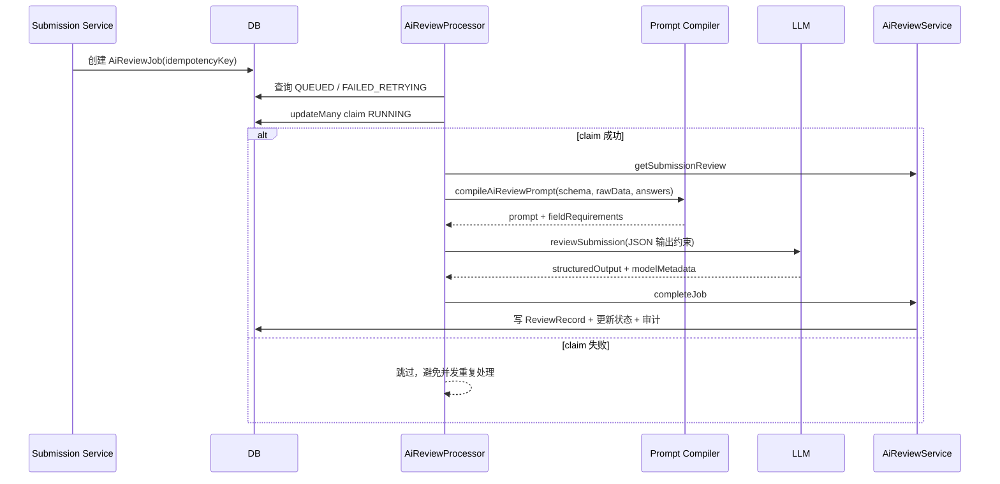

### 幂等关系图

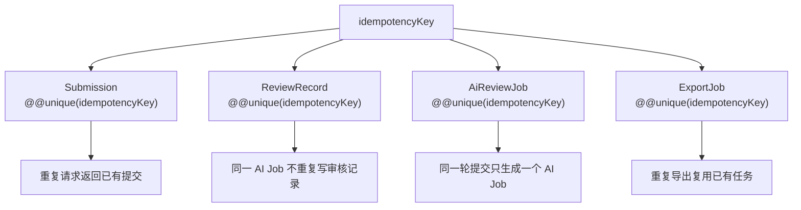

---

## 10. 人工复审、多轮返修与 Diff

### 设计思路

AI 预审不能替代人工复审。人工审核员需要看到 AI 结论、标注答案、历史修改和审计时间线；打回后 Labeler 二次提交时，Reviewer 需要知道本轮和上一轮到底改了什么。

因此项目将人工复审建模为多轮提交和字段级 Diff，而不是覆盖原答案。

### 实现方案

- `Submission.round` 标记提交轮次。
- `ReviewDiffService.listRounds` 查询同一 assignment 的所有轮次。
- `ReviewDiffService.getDiff` 对两个轮次的 `answers` 做字段级比较。
- Diff 结果区分 `added`、`removed`、`changed`，数组字段补充新增项和删除项。
- 人工复审通过时批量将当前待审提交更新为 `FINAL_APPROVED`。
- 人工复审打回时更新为 `NEEDS_REVISION`，并写入审计日志。

### 最终效果

- 每轮提交都被保留，避免覆盖历史。
- Reviewer 可以对比返修前后变化。
- 审核通过/打回都可追踪到状态变化和原因。

### 关键代码

- `apps/api/src/reviews/diff.service.ts:60`
- `apps/api/src/reviews/diff.service.ts:66`
- `apps/api/src/reviews/diff.service.ts:136`
- `apps/api/src/reviews/reviews.service.ts:597`
- `apps/api/src/reviews/reviews.service.ts:614`
- `apps/api/src/reviews/reviews.service.ts:630`

### 多轮复审图

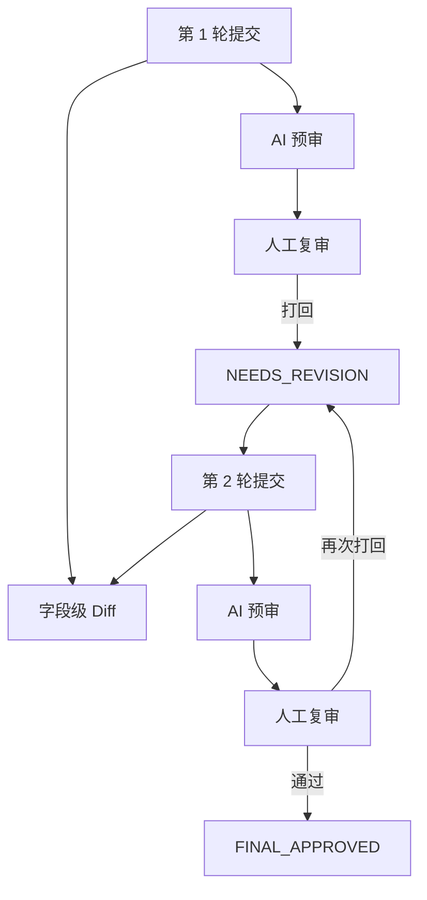

---

## 11. 导出中心、字段映射与结果过滤

### 设计思路

导出不是简单把数据库答案 dump 出来。不同数据集需要不同字段顺序，Owner 可能需要选择是否包含审核信息，而且只有最终通过的数据才应该进入导出。

因此项目把导出拆成导出任务、字段映射、结果过滤和文件生成几部分。

### 实现方案

- `createExport` 接收 taskId、format、fieldMapping、includeReviews、idempotencyKey。
- 导出前先根据 idempotencyKey 查已有任务，重复请求复用已有 job。
- `collectFinalApprovedSources` 只收集 `FINAL_APPROVED` 的提交。
- `ExportMappingService` 提供数据集预设字段映射。
- `normalizeMapping` 清洗外部传入字段映射，无效映射回退到预设。
- `buildRows` 按 `rawData.*`、`answers.*`、`review.*` 路径生成导出行。
- 支持 JSON、JSONL、CSV、XLSX 输出。

### 最终效果

- 导出的数据只包含通过审核的最终结果。
- Owner 可以控制是否包含审核信息。
- 不同数据集有默认字段顺序，同时支持自定义映射。
- 导出任务支持幂等，避免重复点击生成多个文件。

### 关键代码

- `apps/api/src/exports/exports.service.ts:156`
- `apps/api/src/exports/exports.service.ts:300`
- `apps/api/src/exports/exports.service.ts:372`
- `apps/api/src/exports/export-mapping.service.ts:17`
- `apps/api/src/exports/export-mapping.service.ts:54`
- `apps/api/src/exports/export-mapping.service.ts:70`

### 导出数据流图

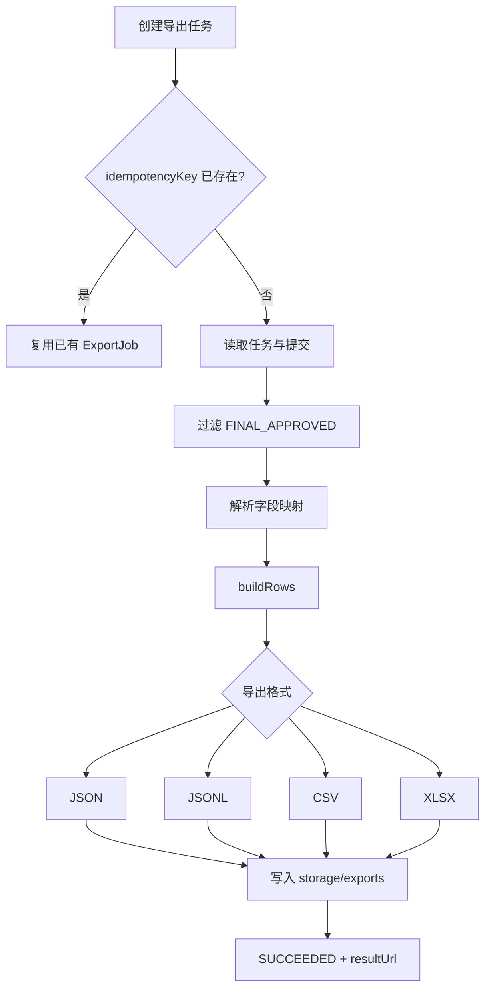

---

## 12. API 响应信封、错误定位与写入校验

### 设计思路

基础平台需要稳定的 API 交互形态。前端不能面对各种不一致响应格式，也不能让错误静默吞掉。每个请求都应该有 requestId，错误应该有明确 code 和 message。

### 实现方案

- 全局 `ResponseEnvelopeInterceptor` 将正常响应包装为 `{ data, requestId }`。
- `HttpErrorEnvelopeFilter` 将异常包装为 `{ error: { code, message }, requestId }`。
- 未处理异常记录到服务端，并返回 `INTERNAL_ERROR`。
- `WriteBodyValidationPipe` 强制写接口 body 必须是 JSON 对象，数组、字符串、null 都会被拒绝。

### 最终效果

- 前后端响应格式统一。
- 错误具备可定位 code 和 requestId。
- 写接口输入边界更清晰，不靠服务层到处兜底。

### 关键代码

- `apps/api/src/app.module.ts:41`
- `apps/api/src/common/filters/http-error-envelope.filter.ts:23`
- `apps/api/src/common/filters/http-error-envelope.filter.ts:56`
- `apps/api/src/common/pipes/write-body-validation.pipe.ts:3`

### 响应流图

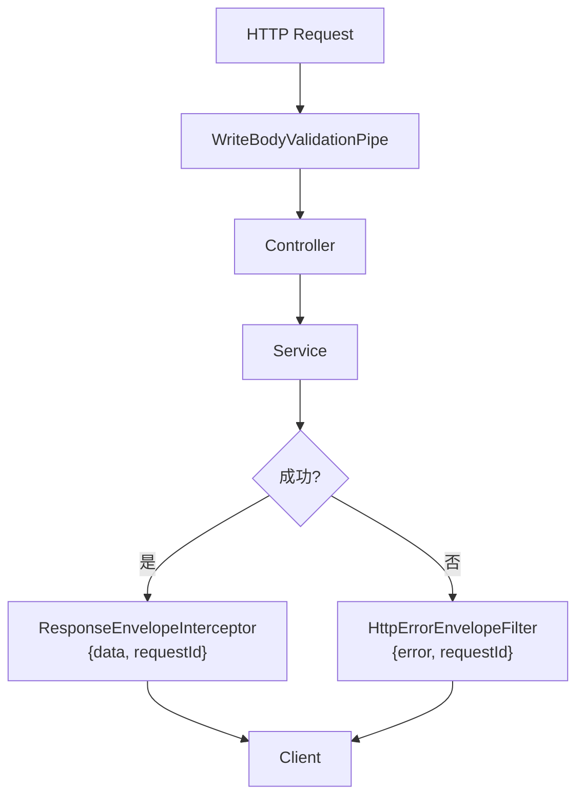

---

## 13. 测试与质量保障

### 设计思路

这个项目的风险集中在跨模块一致性：Schema runtime、状态机、AI 预审、导入导出、模板版本、四端路由。如果只做页面冒烟测试，很难发现底层契约错误。

因此测试分为共享契约单测、服务层单测、前端组件单测和 E2E 流程测试。

### 实现方案

- 共享包测试状态机、状态标签、Schema runtime、模板校验、Prompt 编译、数据集 Profile。
- API 测试服务层业务规则、Prisma schema 关键字段、幂等约束、导入导出。
- Web 测试 SchemaRenderer、模板设计器、页面交互。
- Playwright E2E 覆盖四端路由隔离、主链路、关键页面视口、中文文案和横向溢出。
- Playwright 配置覆盖 1280、1920、2560、3840 四种桌面视口。

### 最终效果

- 共享契约变更能被单测快速发现。
- 核心业务流程具备端到端验收覆盖。
- UI 不只验证可见，还验证中文文案和布局溢出。

### 关键代码

- `packages/shared/src/stateMachines.test.ts:1`
- `packages/shared/src/schemaRuntime.test.ts:1`
- `apps/api/src/prisma-schema.test.ts:168`
- `apps/web/src/features/schema-renderer/SchemaRenderer.test.tsx:1`
- `tests/e2e/quality-hardening.spec.ts:11`
- `tests/e2e/quality-hardening.spec.ts:113`
- `playwright.config.ts:6`

### 测试分层图

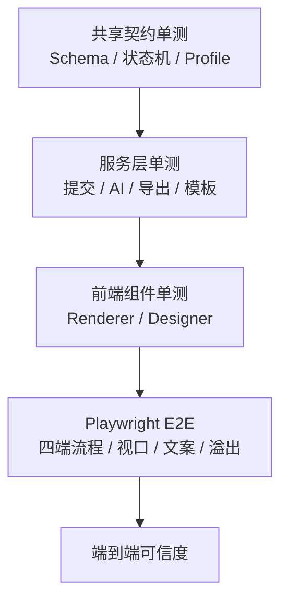

---

## 14. 当前技术亮点汇总

| 技术点 | 解决的问题 | 实现关键词 |
| --- | --- | --- |
| Schema DSL 动态表单 | 不同标注任务无需硬编码页面 | `LabelHubSchema`、`SchemaRenderer`、`SchemaService.validate` |
| 规则 DSL 与联动引擎 | 字段显隐、选项限制、自动赋值可配置 | `StructuredFieldLinkageRule`、AST、parser、serializer |
| 状态机正确性 | 防止任务、提交、AI、导出非法跳转 | `assert*Transition`、显式迁移表、状态机单测 |
| AI Agent 工程化 | 将不稳定 LLM 调用包装为可追踪流程 | Prompt 编译、结构化输出、幂等、重试、元数据 |
| 模板版本与兼容性 | 避免模板变更破坏历史提交 | `schemaVersion`、compatibility report、version diff |
| 数据集导入归一化 | 多格式输入统一成可标注记录 | Dataset Profile、JSONL 行号、CSV 状态机、ExcelJS |
| 导出字段映射 | 只导出最终通过结果并支持多格式 | `FINAL_APPROVED` 过滤、mapping、JSON/JSONL/CSV/XLSX |
| API 信封与错误定位 | 前端统一处理响应与错误 | `requestId`、error code、全局 filter/pipe |

---

## 15. 建议在答辩中重点讲的三句话

1. LabelHub 的动态表单不是前端组件堆叠，而是以 `LabelHubSchema` 为核心的 DSL 架构，同一套 DSL 同时驱动设计器、渲染器、服务端校验、AI Prompt 和导出。
2. 平台把流程正确性显式建模为状态机，非法状态跳转直接抛错，并通过审计日志记录每次业务迁移。
3. AI Agent 不是简单调用模型，而是具备 Prompt 编译、结构化输出、幂等键、重试、模型元数据和审计追踪的工程化处理链路。

