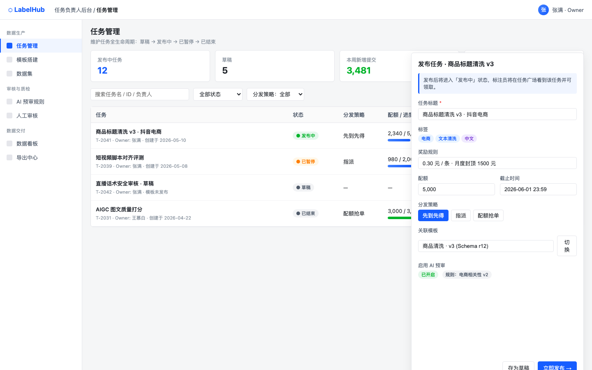
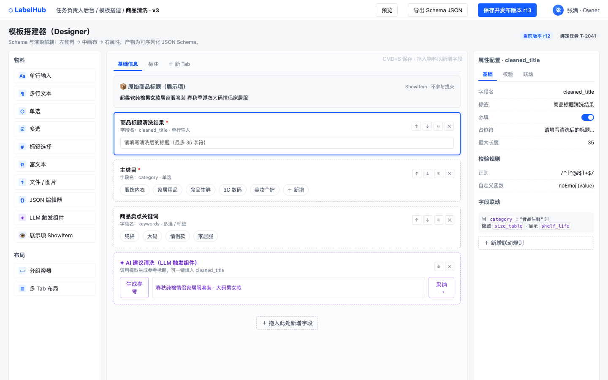
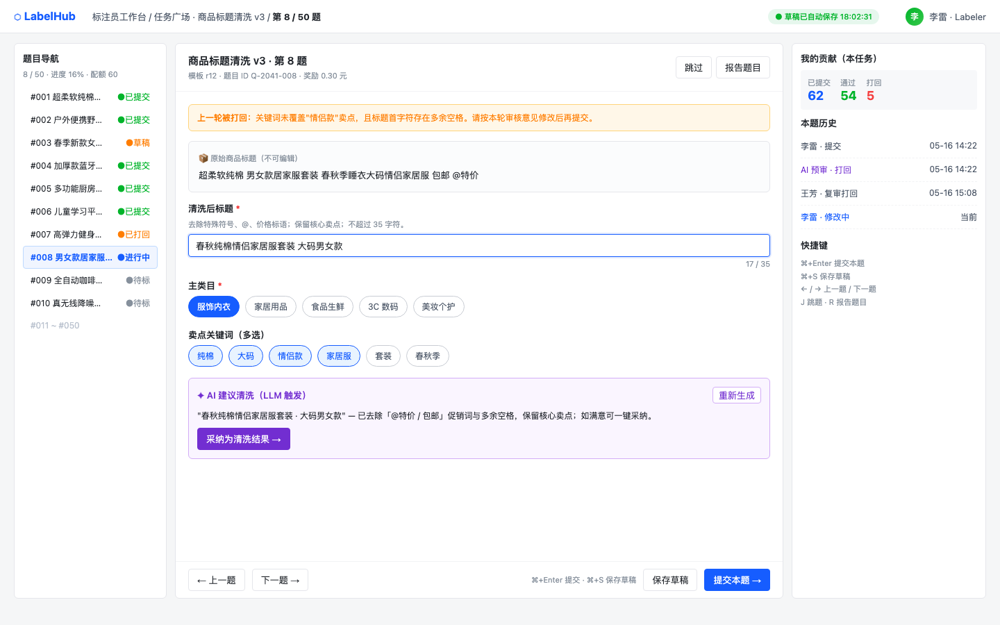
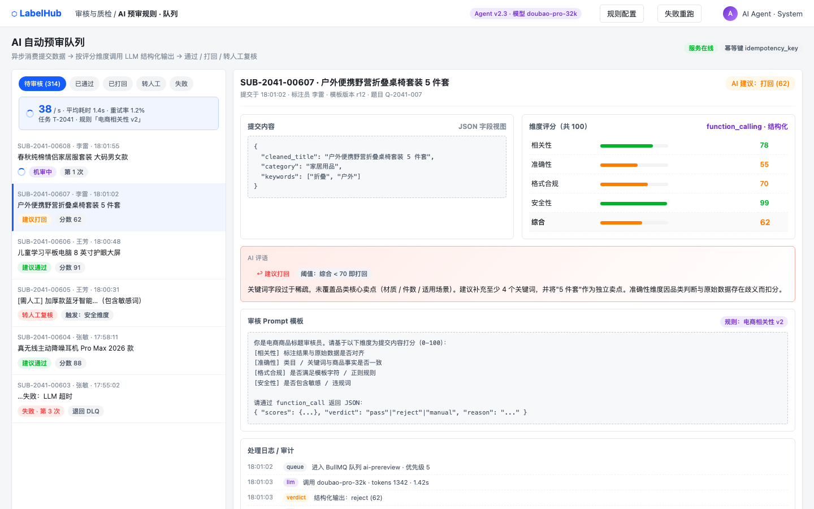
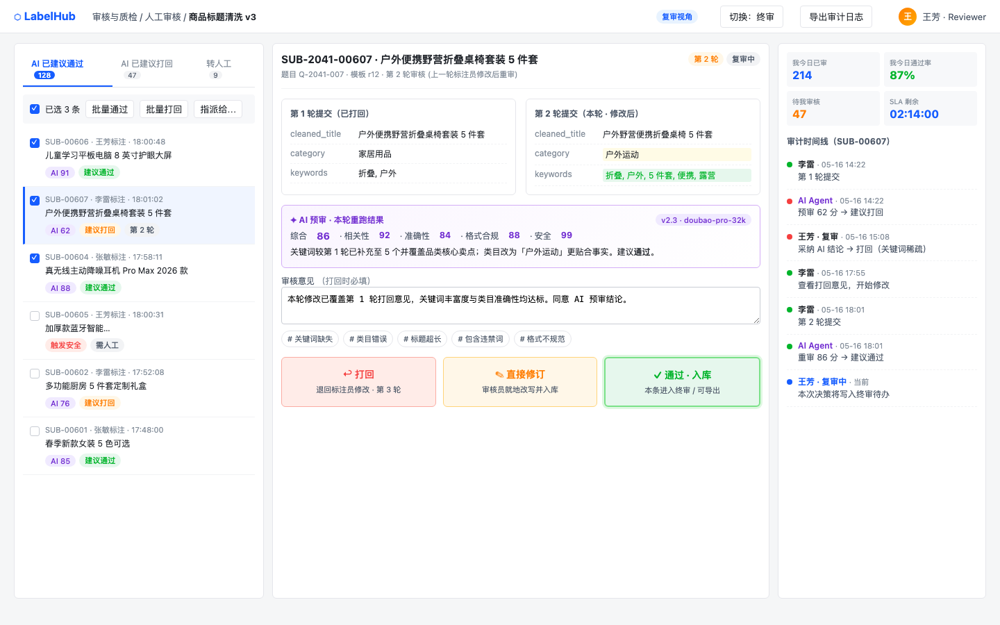

# LabelHub 视觉参考资产

本文档是 LabelHub 后续编码、走查和验收的稳定视觉参考入口。实现图 1-5 对应页面前，Codex CLI 或其他执行者必须先阅读本文档，并在需要确认布局细节时打开对应 PNG。

## 使用约定

- 图片固定保存在 `assets/screenshots/`，文件名不得改名或移动。
- 图片是视觉证据，图片旁的结构化说明是实现约束；当截图细节与文字说明冲突时，先暂停并请项目负责人确认。
- 用户可见 UI 文案必须使用简体中文；技术协议名如 `ShowItem`、`function_calling`、`FINAL_APPROVED` 可以保留英文。
- 五张截图共同约束统一登录、四端隔离和三级审核流水线，不允许回退为单页角色切换或单一审核流程。

## 图 1：Owner 端任务发布

- **端**：Owner 端
- **页面路径**：`/owner/tasks`
- **对应 Batch**：Batch 2，Batch 11，Batch 12
- **页面定位**：任务管理与发布前确认页面。
- **必须还原的布局**：左侧分组导航、顶部面包屑、统计卡片、搜索筛选区、任务表格、右侧发布抽屉。
- **组件术语**：任务状态机、发布抽屉、分发策略、配额、截止时间、关联模板、启用 AI 预审。
- **验收点**：任务生命周期必须覆盖 `草稿 -> 进行中 -> 已暂停 -> 进行中 -> 已结束`，并支持 `进行中 -> 已结束`、`已暂停 -> 已结束`；发布抽屉必须包含任务标题、标签、奖励规则、配额、截止时间、分发策略、关联模板和启用 AI 预审。

## 图 2：Owner 端模板配置

- **端**：Owner 端
- **页面路径**：`/owner/templates/:templateId/designer`
- **对应 Batch**：Batch 3，Batch 4，Batch 11，Batch 12
- **页面定位**：动态标注页面 Designer。
- **必须还原的布局**：左侧物料区、中间画布、右侧属性 / 校验 / 联动配置三栏结构，顶部包含预览、导出 Schema JSON、保存并发布版本。
- **组件术语**：`ShowItem`、`LLM 触发组件`、分组容器、多 Tab 布局、属性配置、校验规则、字段联动、Schema JSON。
- **验收点**：Designer 与 Renderer 必须使用同一份 JSON Schema；Schema 必须支持展示项、输入项、单选、多选、标签选择、富文本、文件 / 图片、JSON 编辑器、分组容器、多 Tab 布局、字段联动和 `LLM 触发组件`。

## 图 3：Labeler 端标注台

- **端**：Labeler 端
- **页面路径**：`/labeler/tasks/:taskId/items/:itemId`
- **对应 Batch**：Batch 6，Batch 11，Batch 12
- **页面定位**：标注员工作台。
- **必须还原的布局**：左侧题目导航、中间标注表单、右侧贡献 / 历史 / 快捷键面板、底部固定操作区。
- **组件术语**：题目导航、草稿自动保存、打回提示、题目级 LLM 辅助调用、提交校验、快捷键。
- **验收点**：必须展示当前题号、提交进度、题目状态、上一轮打回提示、本题历史；保存草稿和提交本题都必须走校验，题目级 LLM 辅助结果必须可采纳到当前字段。

## 图 4：AI Agent 端机审

- **端**：AI Agent 端
- **页面路径**：`/agent/ai-review`
- **对应 Batch**：Batch 7，Batch 11，Batch 12
- **页面定位**：AI 自动预审队列与机审详情。
- **必须还原的布局**：左侧异步队列、状态分组、重试入口；右侧提交内容、JSON 字段视图、维度评分、AI 评语、Prompt 模板、处理日志。
- **组件术语**：异步队列、维度评分、`function_calling` 结构化输出、Prompt 模板、失败重试、人工兜底、幂等键。
- **验收点**：AI Agent 必须异步处理提交，输出结构化评分、结论和原因；失败任务必须支持重试，连续失败或安全风险必须转人工兜底；所有机审动作必须写入审计日志。

## 图 5：Reviewer 端验收

- **端**：Reviewer 端
- **页面路径**：`/reviewer/reviews`
- **对应 Batch**：Batch 8，Batch 9，Batch 11，Batch 12
- **页面定位**：人工复审与终审验收台。
- **必须还原的布局**：左侧待审列表与批量操作、中间第 1 / 2 轮 Diff 视图、AI 预审结果、审核意见与操作卡片、右侧统计与完整审计时间线。
- **组件术语**：复审视角、终审视角、Diff 视图、AI 评语、批量操作、审计时间线、打回、直接修订、通过入库。
- **验收点**：审核主链路固定为 `AI 自动预审 -> 人工复审 -> 终审`；人工复审通过只能进入终审待办，只有终审通过的 `FINAL_APPROVED` 数据可导出；打回后二次提交必须展示第 1 / 2 轮 Diff。
