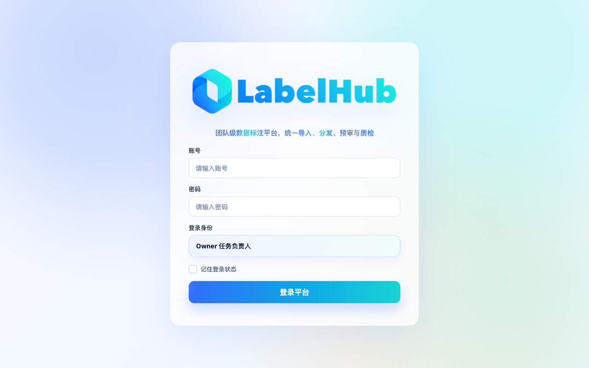
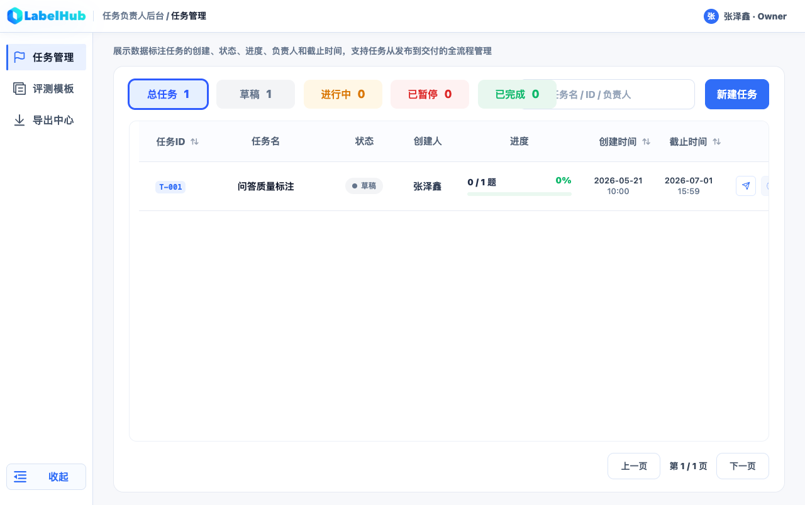
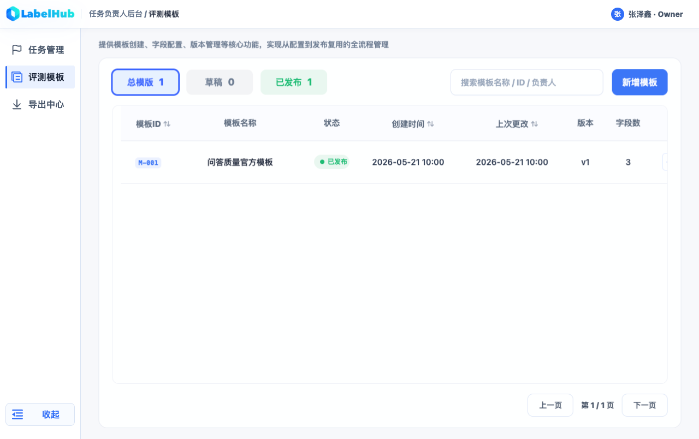
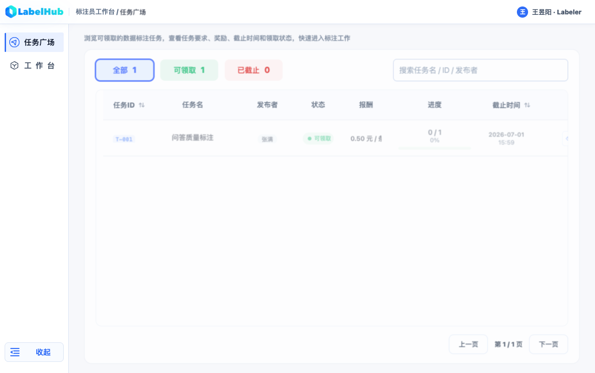
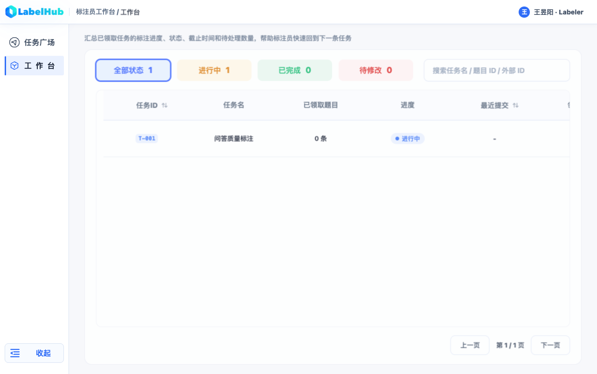
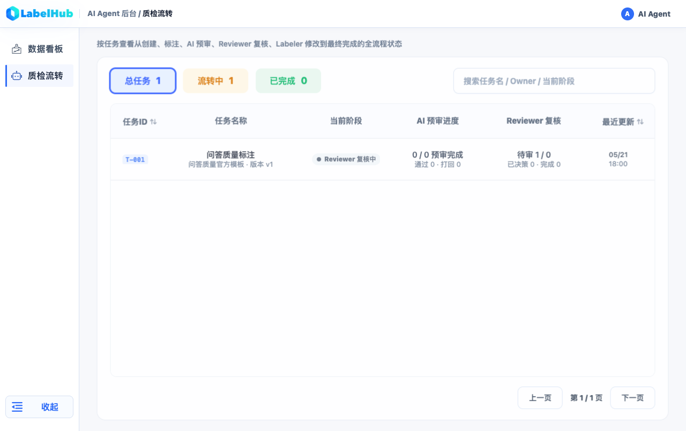
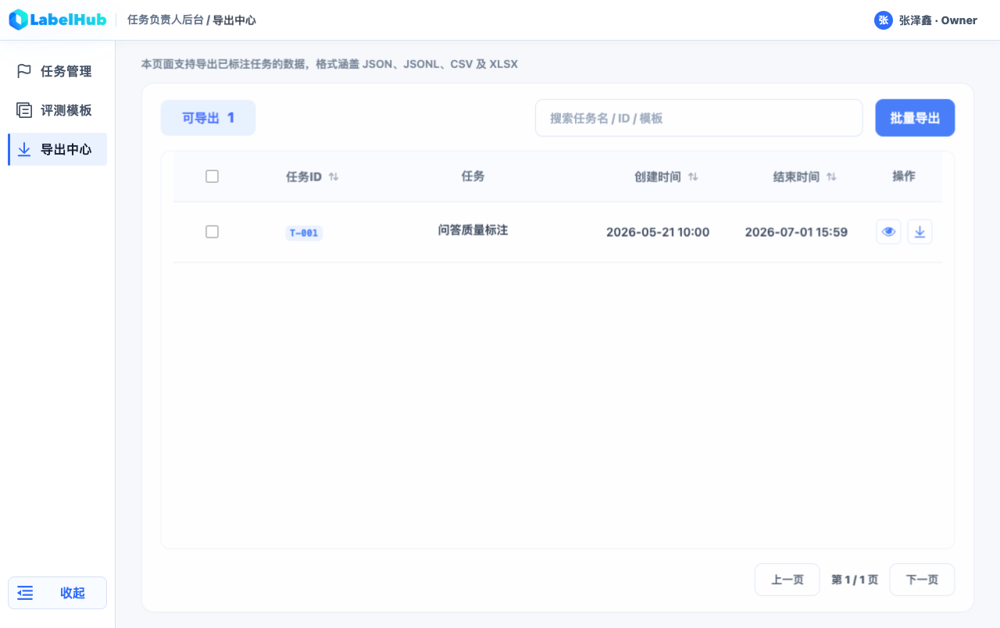

# E2E 全量回归

- 时间：2026-06-13 20:34
- 测试分类：端到端
- 触发原因：全量 E2E 回归
- 结论：部分通过（6/7 通过，1 超时）

## 执行信息

| 项目 | 内容 |
|-|-|
| 执行时间 | 2026-06-13 20:33 CST |
| 测试入口 | `tests/e2e/*.spec.ts`（4 文件 7 用例） |
| 浏览器 | Chrome（本机 channel） |
| 命令 | `PW_BROWSER_CHANNEL=chrome PW_REUSE_EXISTING_SERVER=1 pnpm exec playwright test --project=chromium-1280` |
| 结果 | 6 passed / 1 failed |
| 耗时 | 54.2s |

## 覆盖步骤

| 步骤 | 用例 | 结果 |
|-|-|-|
| 1 | `owner-tasks.spec.ts` — Owner 任务管理发布抽屉与状态流转 | 通过 |
| 2 | `renderer-playground.spec.ts` — Renderer 调试台示例切换、模式切换、答案保留 | 通过 |
| 3 | `quality-hardening.spec.ts` — 四端路由隔离和无权限拦截 | 通过 |
| 4 | `quality-hardening.spec.ts` — Owner 创建 qa_quality 任务、导入并发布 | 通过 |
| 5 | `template-designer.spec.ts` — 评测模板新建草稿、配置字段并持久化 | 通过 |
| 6 | `quality-hardening.spec.ts` — 主链路：领取→草稿→提交→AI→打回→二次提交→Reviewer 通过→四格式导出 | **超时失败** |
| 7 | `quality-hardening.spec.ts` — 关键页面四视口截图、中文文案、横向溢出 | 通过 |

## 接口与数据断言

| 断言 | 期望 | 结果 |
|-|-|-|
| 7 个 E2E 用例 | 全部通过 | 6 通过 |

## 失败分析

**用例**：`quality-hardening.spec.ts:59` — 主链路全流程

**位置**：`line 66` — `page.getByLabel('通过').click()`

**页面**：`/labeler/tasks/task_qa/items/item_qa_1?assignmentId=assignment_1`（标注台）

**错误**：30s 超时未找到 `getByLabel('通过')` 元素。

**可能原因**：
- Labeler 标注台的标注字段渲染异常，`通过` radio/label 未出现在 DOM 中
- 模板 schema 渲染失败导致标注字段缺失
- 页面导航后未正确加载标注项数据

**Trace**：`test-results/quality-hardening-主链路覆盖领取、-464a4-打回、二次提交、Reviewer-通过入库和四格式导出-chromium-1280/trace.zip`

## 页面截图

## 产物

| 产物 | 路径 |
|-|-|
| Playwright HTML 报告 | `playwright-report/index.html` |
| Trace（失败） | `test-results/quality-hardening-主链路覆盖领取、-464a4-.../trace.zip` |
| 本报告 | `docs/verify/reports/e2e-full-regression-20260613-2033.md` |

## 失败与修复

- 主链路全流程超时在标注台 `getByLabel('通过')`，需查看 trace 确认标注台是否正确渲染了 schema 字段。

## 未覆盖风险

- 主链路的 AI 预审→打回→二次提交→Reviewer 通过→导出段未跑通，该路径的回归风险未消除。
