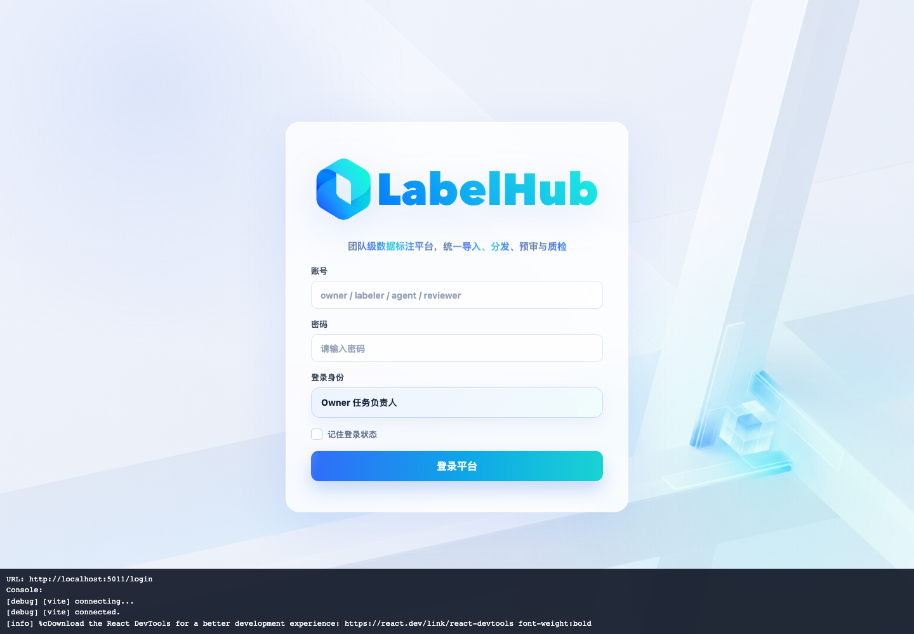
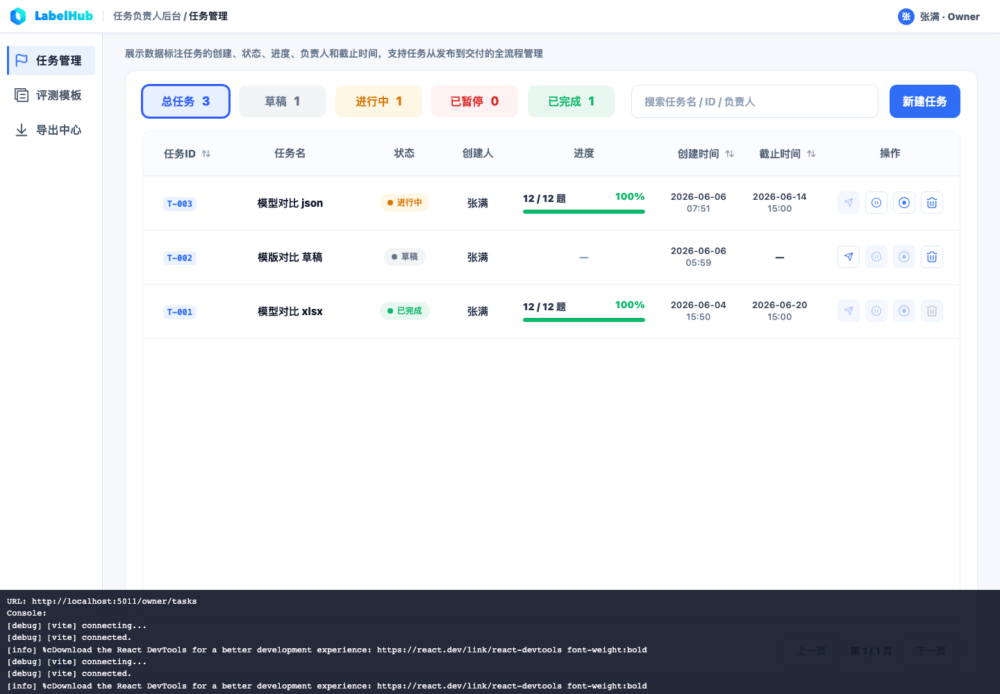
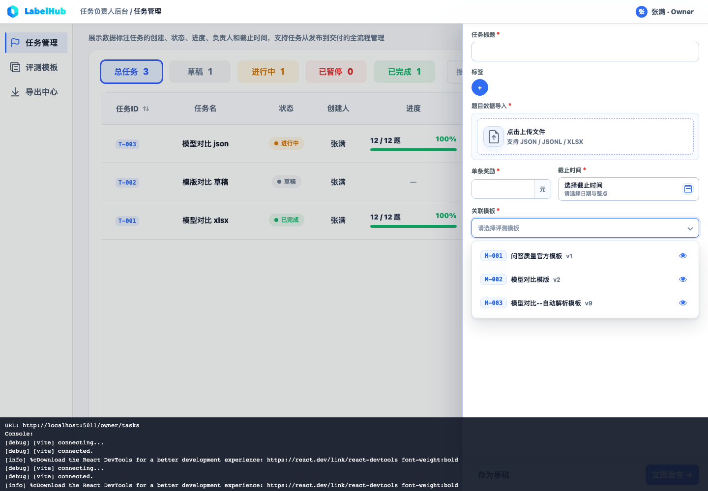

# Preflight Fix Report: qa_quality 专用模板

## 发现的问题

当前环境最初只有 `模型对比模版` 和 `模型对比--自动解析模板`，没有可用于 `/datasets/qa_quality` 的已发布专用模板。

同时，共享官方 `qa_quality` profile 原本没有覆盖 `标注要求.md` 要求的全部组件类型。

## 修复动作

1. 补齐共享官方 `qaQualitySampleSchema`。
2. 同步前端 renderer 示例 `qaQualitySchema`。
3. 通过模板 API 基于 `qa_quality` profile 创建并发布 `问答质量官方模板`。

## 修复后的模板字段类型

证据文件：`./qa-quality-template-api-result.json`

修复后的模板字段类型包括：

1. `show_item`
2. `radio`
3. `tag_select`
4. `text`
5. `textarea`
6. `rich_text`
7. `json_editor`
8. `file_upload`
9. `image_upload`
10. `llm_assist`

## UI 证据

Owner 登录页：

Owner 任务列表：

Owner 新建任务后模板下拉可见 `问答质量官方模板` 和 `模型对比模版`：

## 结论

`preference_compare` 可以继续使用现有 `模型对比模版`。

`qa_quality` 当前已有按 `标注要求.md` 补齐后的专用模板 `问答质量官方模板`，可以进入后续全流程验证。
