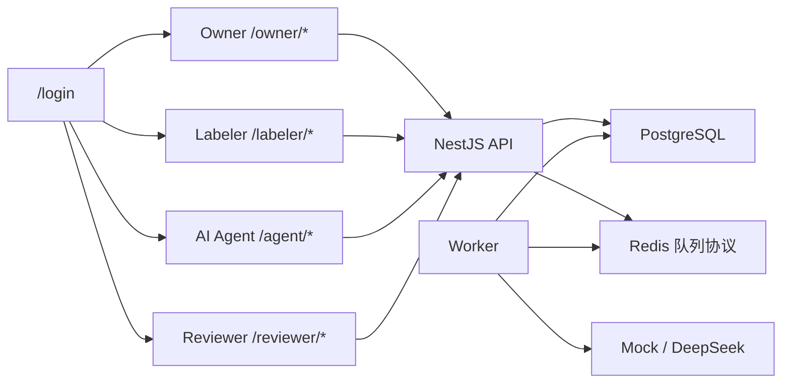
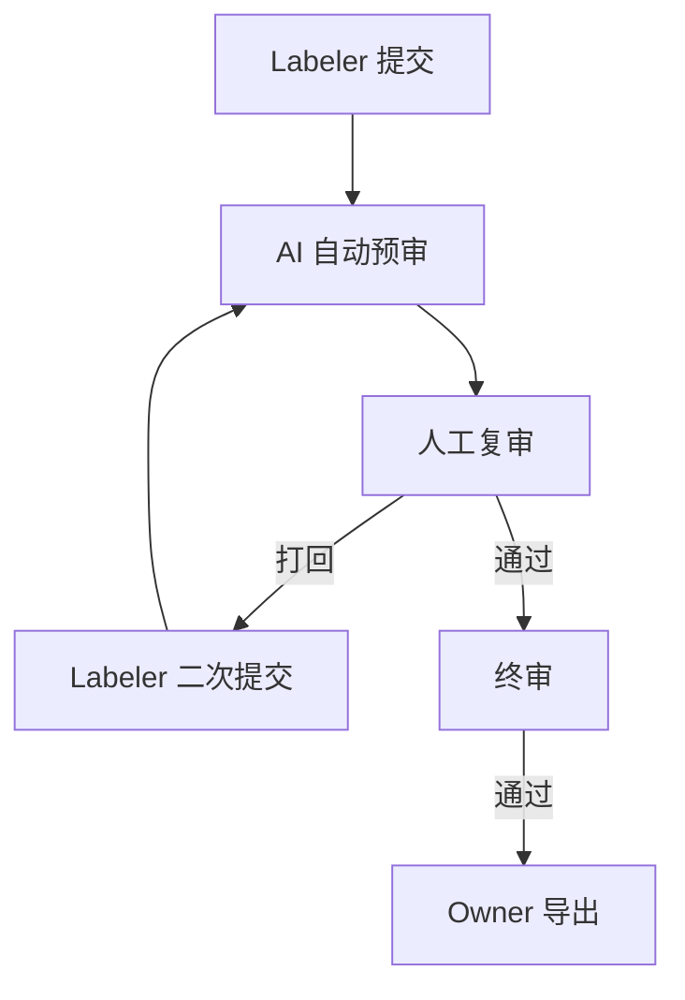

# 架构摘要

完整架构图见 `docs/architecture.md`。本摘要用于评审快速理解。

## 核心链路

## 三级审核

人工复审通过只进入 `FINAL_PENDING`，终审通过后才是 `FINAL_APPROVED`。导出中心只读取 `FINAL_APPROVED`。

## 三个技术重点

1. 动态表单：Designer 生成 Schema，Renderer 使用同一份 Schema 作答。
2. 状态机：任务、提交、AI 审核、人工审核、终审和导出都收敛到有限状态流转。
3. AI Agent：mock provider 保证演示稳定，DeepSeek provider 只读环境变量，AI 过程保留结构化输出、Prompt、日志、幂等和审计。
