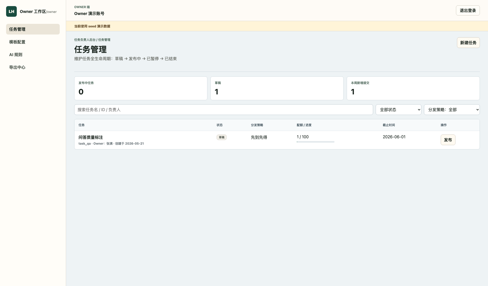
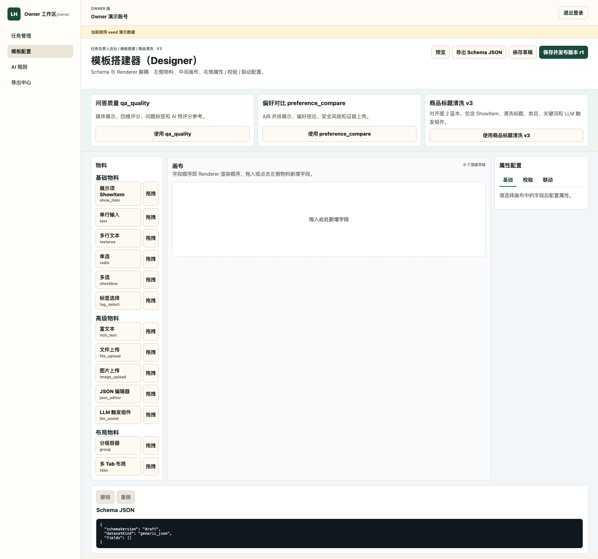
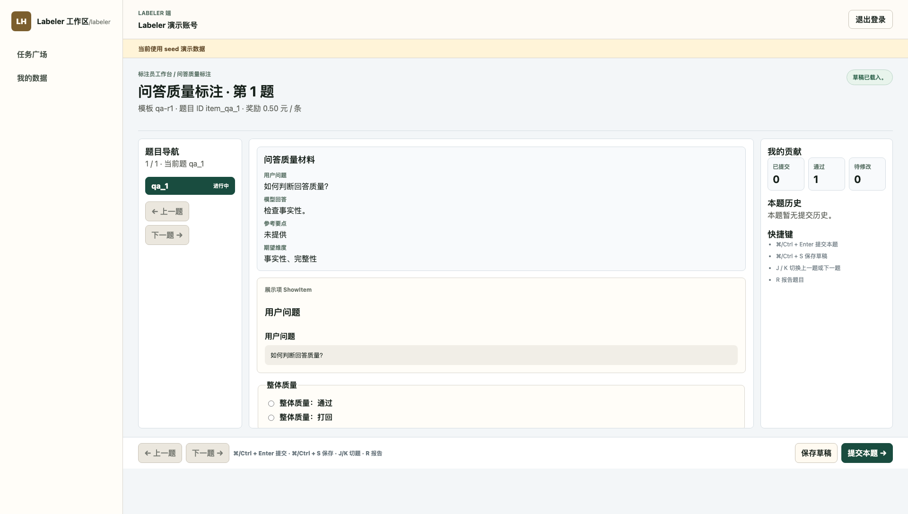
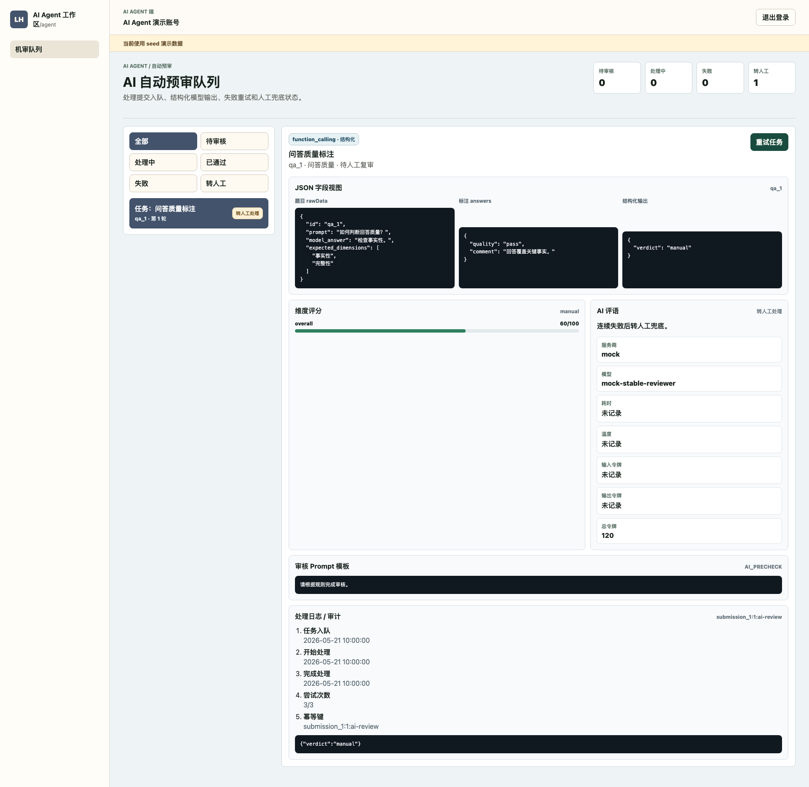
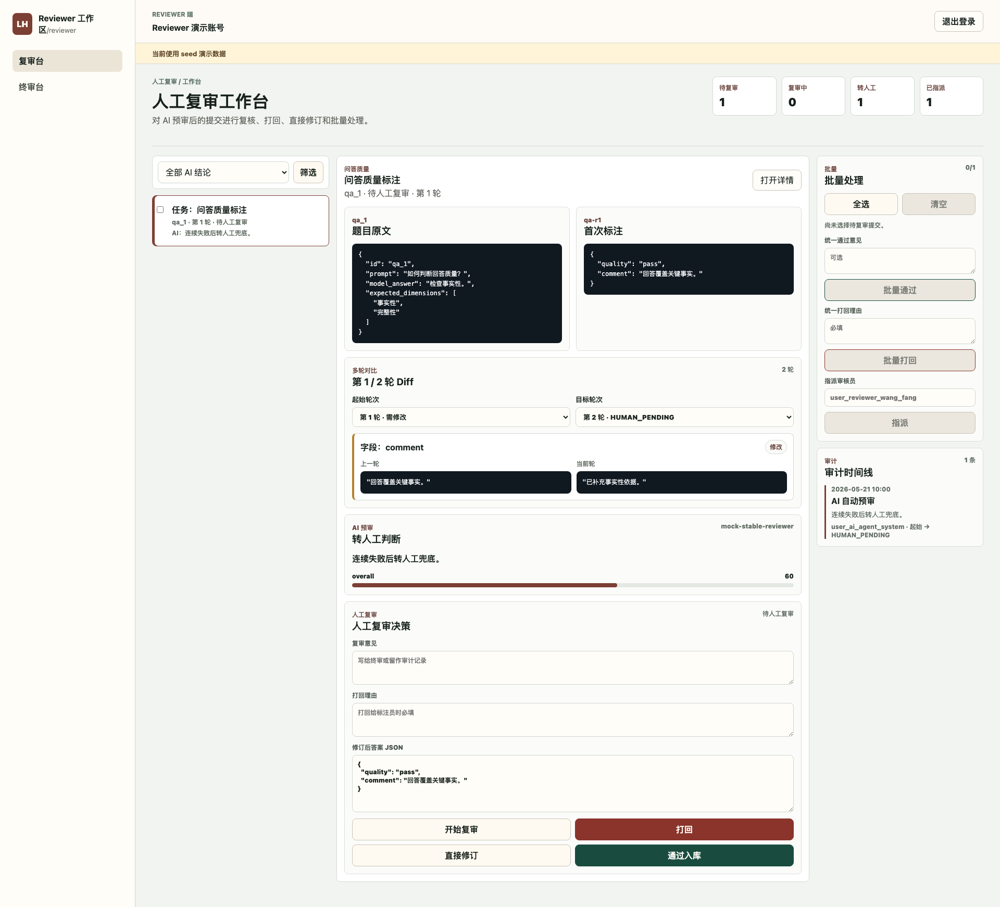
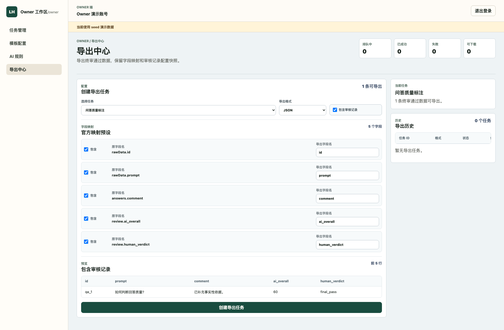

# Demo 截图清单

截图来自 Playwright E2E：`tests/e2e/quality-hardening.spec.ts` 的 1920 视口截图。E2E 同时覆盖 1280 和 1920 两个视口，并检查核心页面中文文案和无横向溢出。

| 顺序 | 文件 | 页面 | 验收点 |
| --- | --- | --- | --- |
| 1 | `screenshots/01-owner-task-publish.png` | `/owner/tasks` | Owner 任务管理、统计、筛选、任务表格、发布抽屉 |
| 2 | `screenshots/02-owner-template-designer.png` | `/owner/templates` | 模板 Designer、物料区、画布、属性配置 |
| 3 | `screenshots/03-labeler-workbench.png` | `/labeler/tasks/:taskId/items/:itemId` | 标注台、题目导航、草稿、提交、历史 |
| 4 | `screenshots/04-agent-ai-review.png` | `/agent/ai-review` | AI 预审队列、结构化输出、Prompt、日志 |
| 5 | `screenshots/05-reviewer-review-flow.png` | `/reviewer/reviews` | 人工复审、Diff、AI 评语、审计时间线 |
| 6 | `screenshots/06-owner-export-center.png` | `/owner/exports` | 导出预览、字段映射、四格式导出 |

## 截图预览

